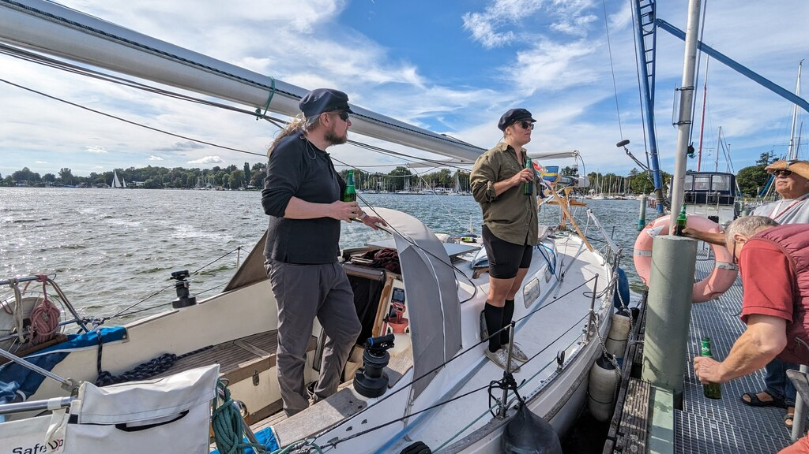

After a lazy morning, we hoisted anchor and followed a cruise ship through the Spandau locks. Only a short wait for a freighter coming the other way, and we were let in.

Finally back in our "home territory"! Almost six months, and over three thousand miles have passed since we were here the last time. Today is a bit rolly, so hoisting the mast shall wait until tomorrow.

 

* Distance today: 6.3NM
* Total distance: 3022.3NM
* Engine hours: 1.5
