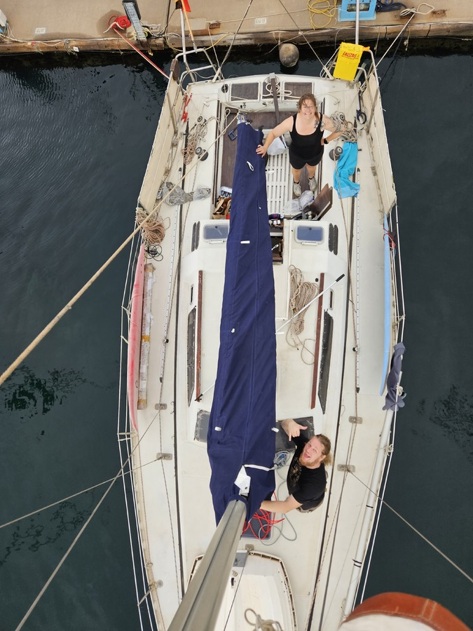
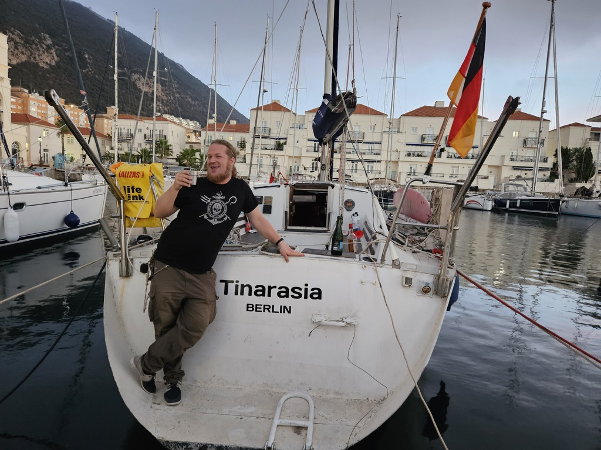
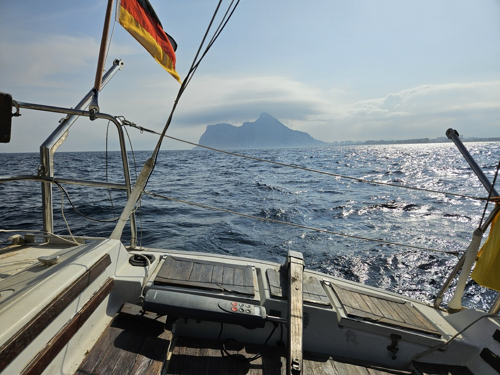
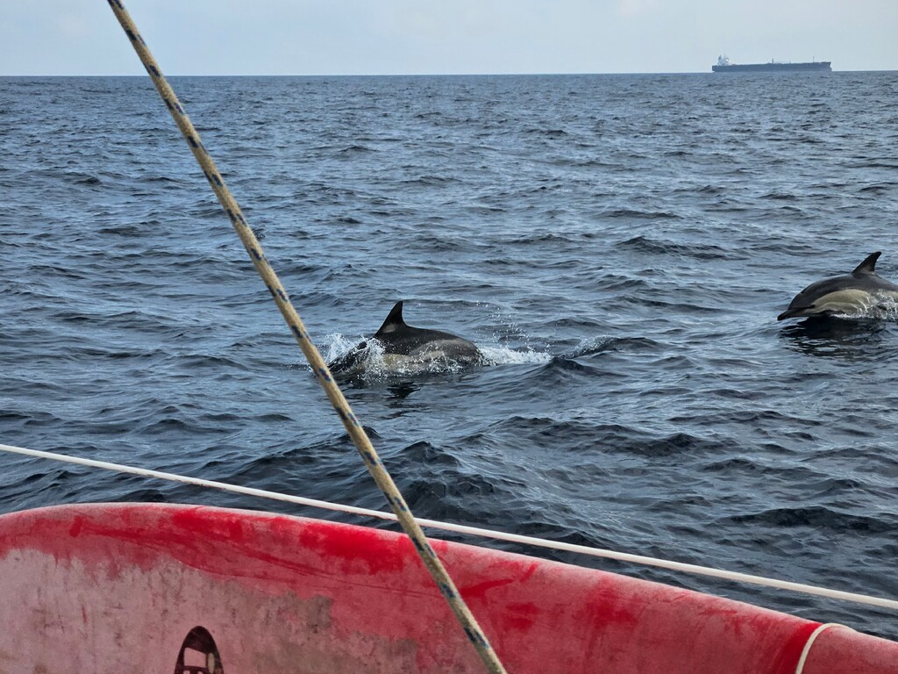
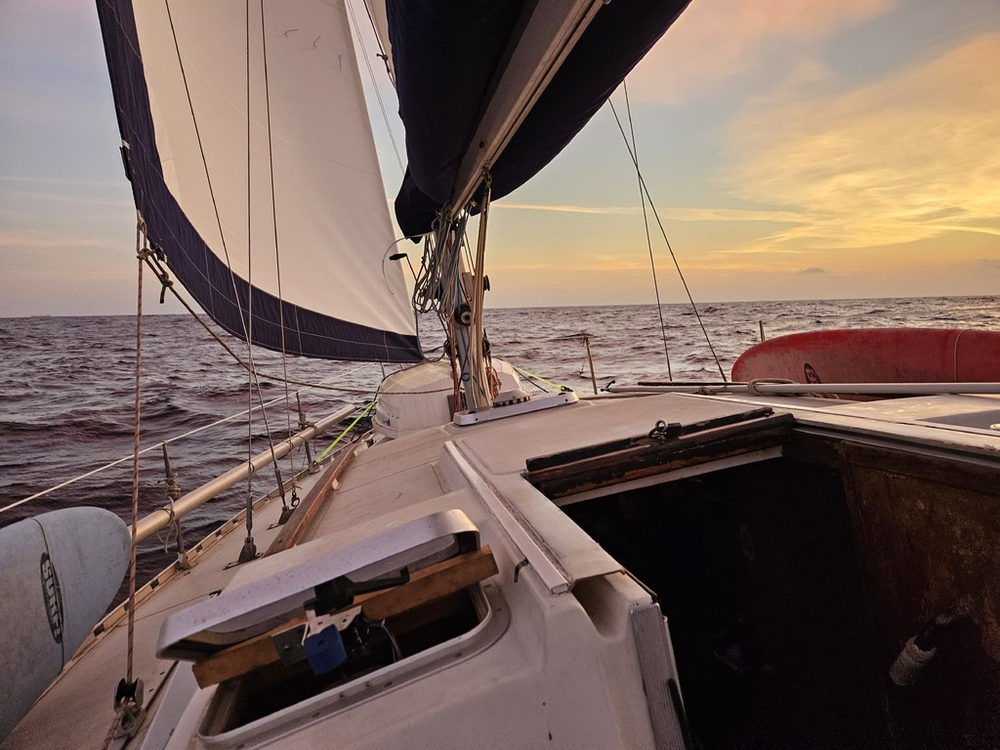
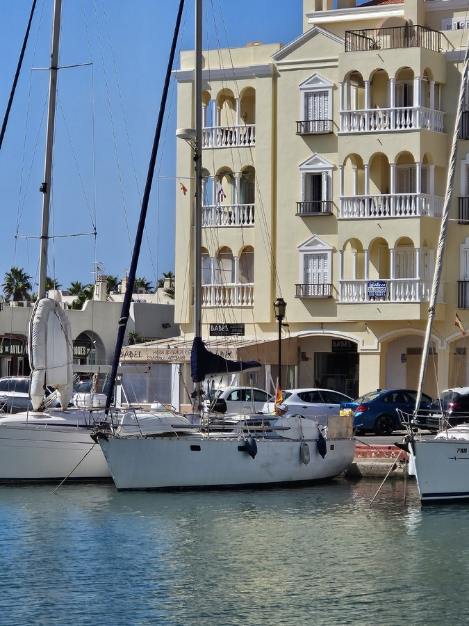
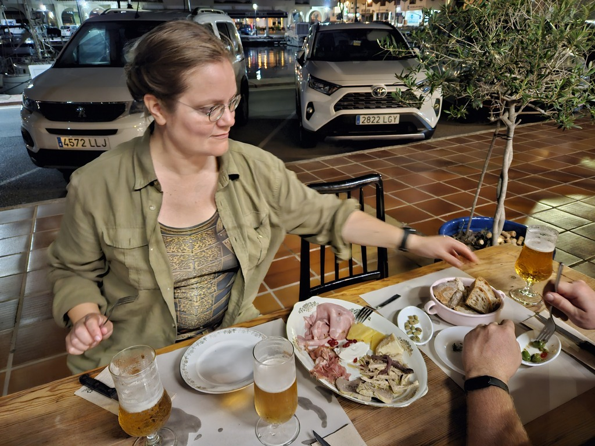

Our friends bought Alu Plaisance Legende 36 sailboat, an aluminium centerboard sailboat with an electric inboard, that was located in Gibraltar. They wanted to move the vessel to a more affordable Spanish shipyard for a refit, and asked us to help with the delivery. 

 

We flew to Malaga on October 3rd with luggage full of sailboat equipment. With a rental car we were able to bring all that plus some provisions over to Gibraltar. The next couple of days were hectic, getting the badly neglected boat ready for the sea. Some safety equipment, new radios and electronics, replacement for most of the running rigging, the list was long.

We also performed the traditional ship renaming ritual, with the boat now called _Tinarasia_ (in line with the first boat of the same owners, _Kumikana_).

 

Finally on Friday we were ready for the shakedown sail. A short motor run to the marina in La Linea to clear ourselves and the vessel into EU. Then sails up, and tacking around the weird local wind conditions that surround the Rock of Gibraltar.

 

We arrived to the target of this test sail, the marina at Sotogrande just before sunset. Now we knew how the boat behaved under sail and (electric) motor. As is traditional, we also had several things to fix, from broken autopilot bracket to a cockroach problem caused by the copious amounts of open food containers left on board by the previous owner. At 1pm we felt ready to press on, and plotted a course east.

Due to the large amounts of lobster pots, and the available favourable current, we decided to head well offshore, tacking our way just north of the main Mediterranean shipping lane.

 

Winds were lighter than forecasted, but we kept going. Our slow but steady progress was rewarded with many of the wonders of offshore sailing. Dolphins playing in our bow wave, bioluminiscent plankton in our wake, shooting stars, and a large pod of pilot whales that followed us for a while.

But also various issues. The DC-DC system feeding our house bank kept failing. AIS and VHF antennas somehow lost their range. And that autopilot bracket fix we made in Sotogrande failed and had to be McGyvered. Cruising life.

 

After three days and two nights at sea, we pulled into the marina of Almerimar. Our plan was to reprovision here and do some repairs (starting with a badly leaking shaft seal) before pressing on. As is often in the Mediterranean, there would be no sailing winds for the next week, and so we'd need to motor. Our plan was to do this with the help of a recently acquired petrol generator.

But as it turned out, the generator wasn't strong enough to keep up with the battery charger. We took a stock of all the local (and well equipped) chandleries, but none of them could supply us with a suitable 48V charger in time. So that means the boat shall stay here for the winter. Not the worst option, and as it happens, also the base of operations for the boat with the three previous owners.

 

This now leaves us some time to finish a few more boat projects, as well as to try the Mediterranean sailing experience of going out for some anchoring and swimming. Then back to Berlin and the Project Season.

