The question of a dinghy is one that all cruisers need to answer. There are multiple options available and you need to pick the one for your requirements and budget. Our budget an needs lead us to the world of self-built hard dinghys, and we chose the [Spindrift 9 nesting dinghy](https://bandbyachtdesigns.com/s9)  from B&B Yacht Designs as the one.

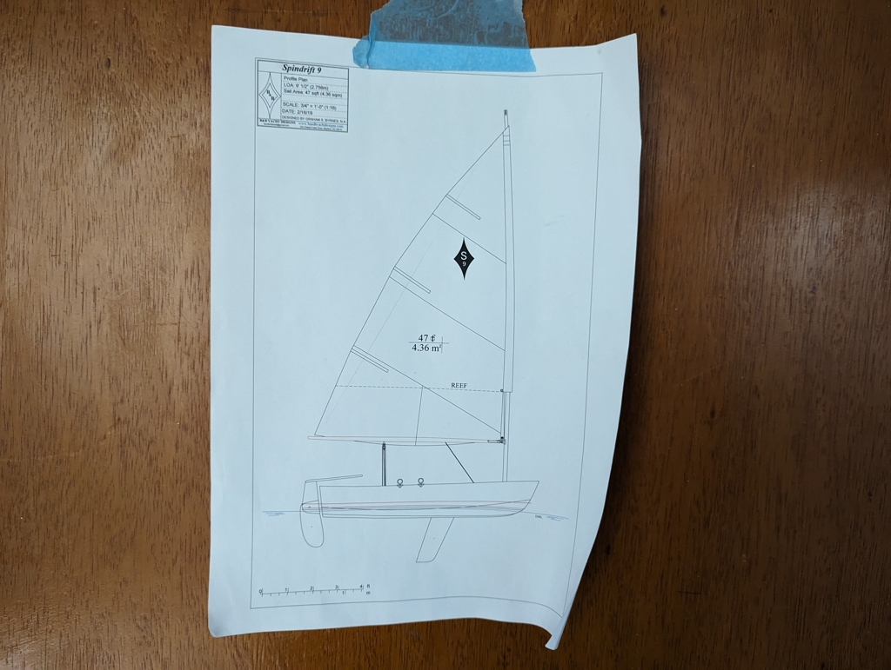 

The project started with ordering the plans and familiarising ourselves with them. After having a somewhat good overall understanding, Suski meticulously drew the cut plan on Autodesk Fusion 360 for cutting. There are build kits available, but they ship from either US or UK, so it was easier to find a place with a big CNC in Berlin instead. Armed with the 3 files and 4 sheets of okume plywood we drove to [Cadus](https://www.cadus.org/en/) and proceeded to cut all the pieces required. And we didn't even need the extra sheet or any of the reserve milling bits as all of the cutting went as planned.

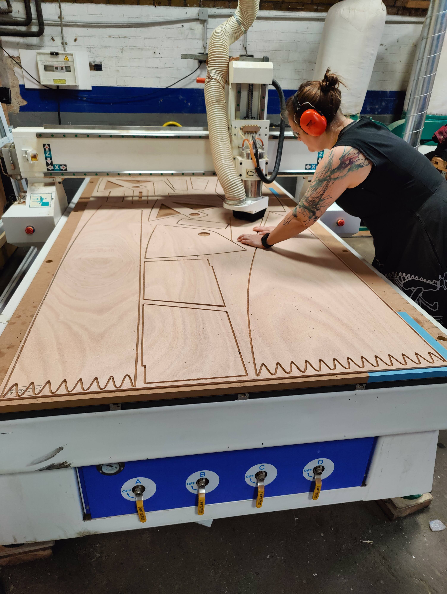 

After this it was time to deal with the solid stock. We did all of that at [c-base](https://c-base.org/) workshop, where Suski has spent most of her Fridays for the last 10 years. The raw materials were transformed to wood chips, cleats and benches. Also the first pieces were glued together and we had our build in progress. 

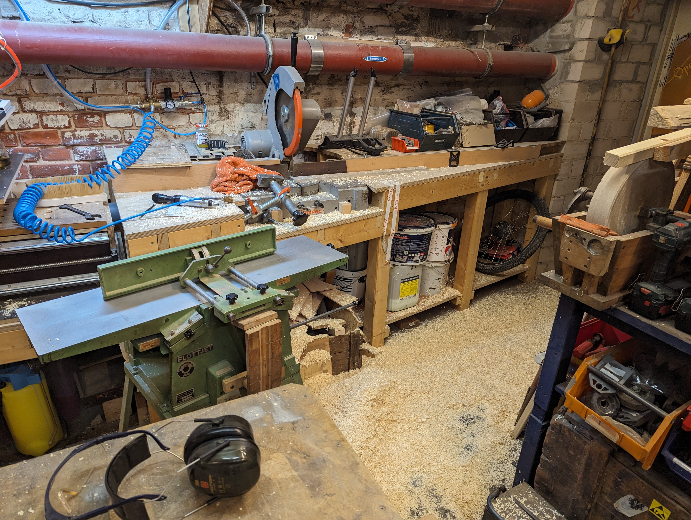 

Transporting the long pieces through the city with public transport was successful and we didn't even get any weird comments about it!

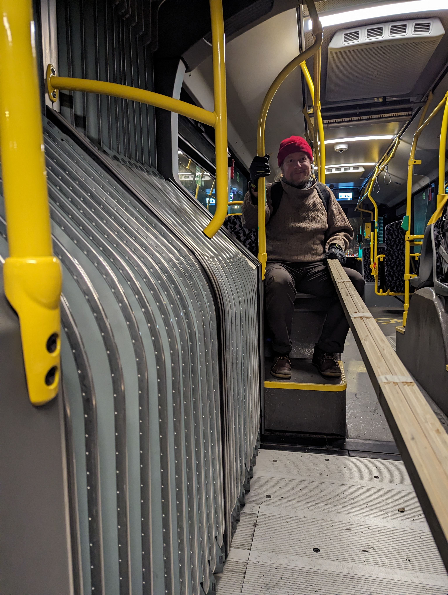 

When we had all the pieces at Gothia, it was time to start building for reals. We started by gluing together the long side and bottom pieces, and after proceeded to glue and glass the butterfly seam. We attached zipties loosely on the center seam and were ready for the the exiting moment of opening the boat into a 3D shape. Before opening we had hot towels on the outside sides of the plywood and with minus degrees outside the relative humidity was aroud 40% and we were afraid of cracks.

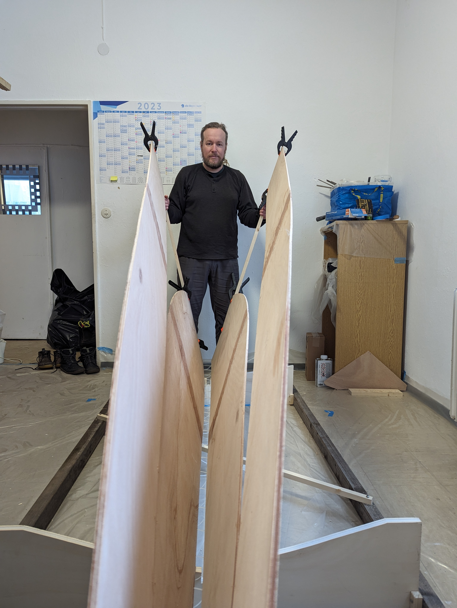 

 We attached helper supports with clamps at the end of the butterfly so that it was easier to handle the pieces. Ever so slowly we started pushing the pieces into their correct shape removing clamps from supports as necessary. In about 2 hours we had the required shape with transom in place and all zipties tight. Success!

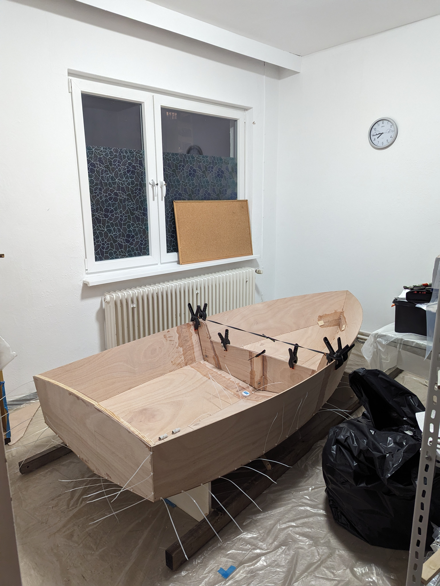 

After we had the shape we left the boat to settle for the night. In the morning we tightened all of the zipties once more and proceeded to cut out and glue the breasthook and quarter knees. Those in place we ziptied in the nesting bulkhead and wrestled in and glued the gunwales. Getting the gunwales in place was the hardest part of the whole build. We were just the 2 of us but more extra hands might have made it easier. So when the plan calls for "extra hands" be warned that you really need them.

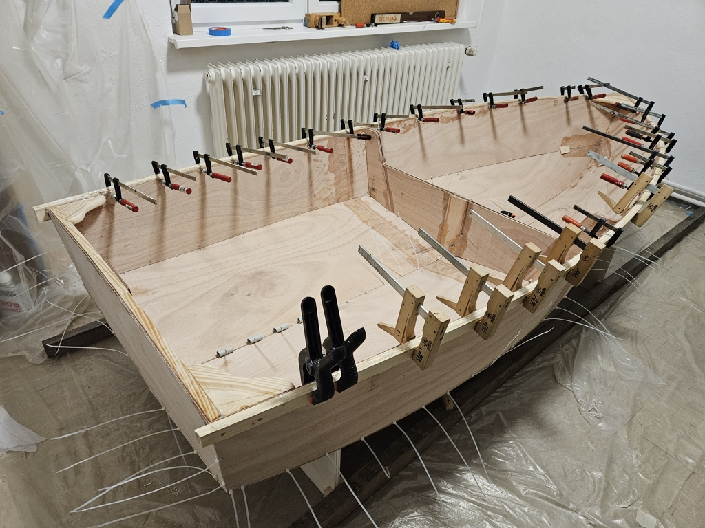 

Withg gunwales in place we tack welded the inside seams. After curing time it was time to remove all zipties and fillet and glass all the inside seams. Then we moved on to installing aft seats and the forward bulkhead. We decided to paint the inside of the aft seats with white paint on top of the epoxy layers in the hopes of having it easier time to find the snacks hidden inside the benches later on. Daggerboard trunk and king plank went in smoothly. Then we turned the boat over and glassed the outside seams.

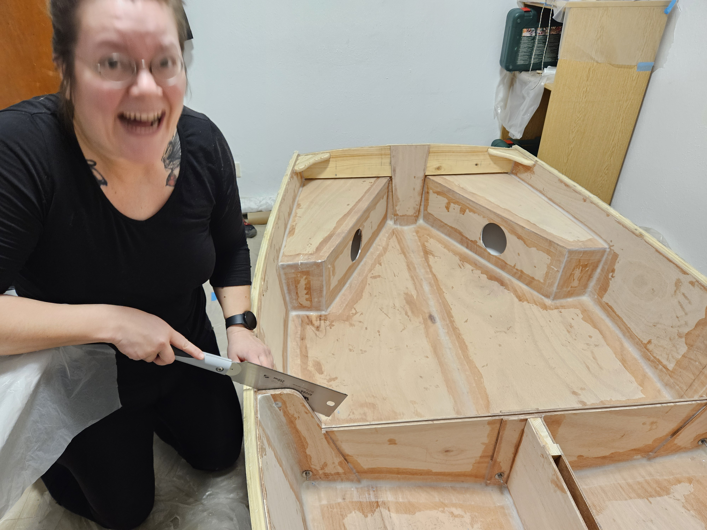 

Then came the day of the cutting the boat in half. A terrifying experience indeed. With a fair amount of cursing, the boat was in two pieces with only one cut into the bulkhead. If I would do this a second time I would remove all the spacer cardboard first and only then start cutting. For us the cardboard was jamming the saw and it was hard to 'feel' whether you were cutting only 6mm of plywood or something more. But the boat was in two pieces and the nesting test was a success. Phew! We celebrated with a well earned beer, thanks Henrik!

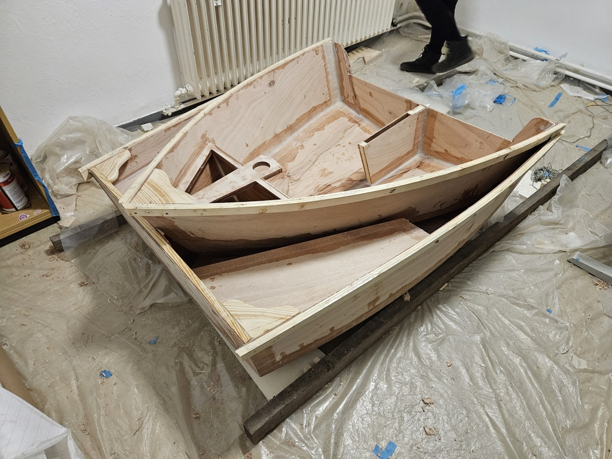 

We bolted the boat back together, and planed the gunwales to their correct height and shape. The thwart was shaped and its supports cut and glued in place. The breasthook and quarter knees got their bronze screws and rope holes. Then we glassed in cloth on the inside and outside.

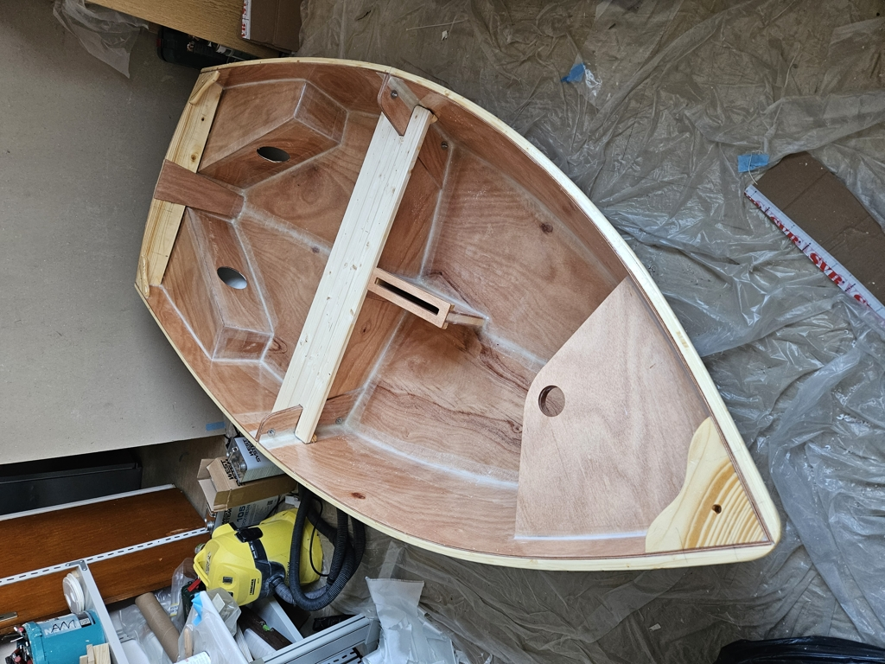 

We shaped the keel and glued it to the bottom. Followed by sanding, [oh glorious sanding](https://saillifeshop.com/products/short-sleeve-unisex-t-shirt-1).

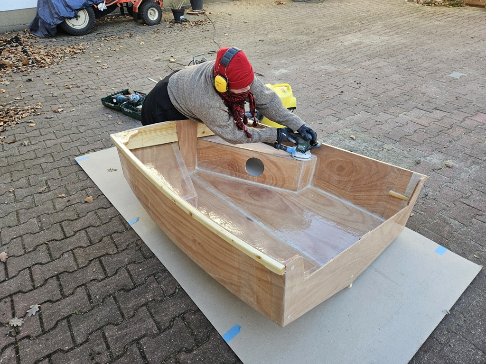 

At this point we deemed the hull to be fair enough as the day of moving out of the workshop room was getting closer. Then it was layers and layers of paint on both sides ending with a layer of Kiwigrip on the inside bottom. 

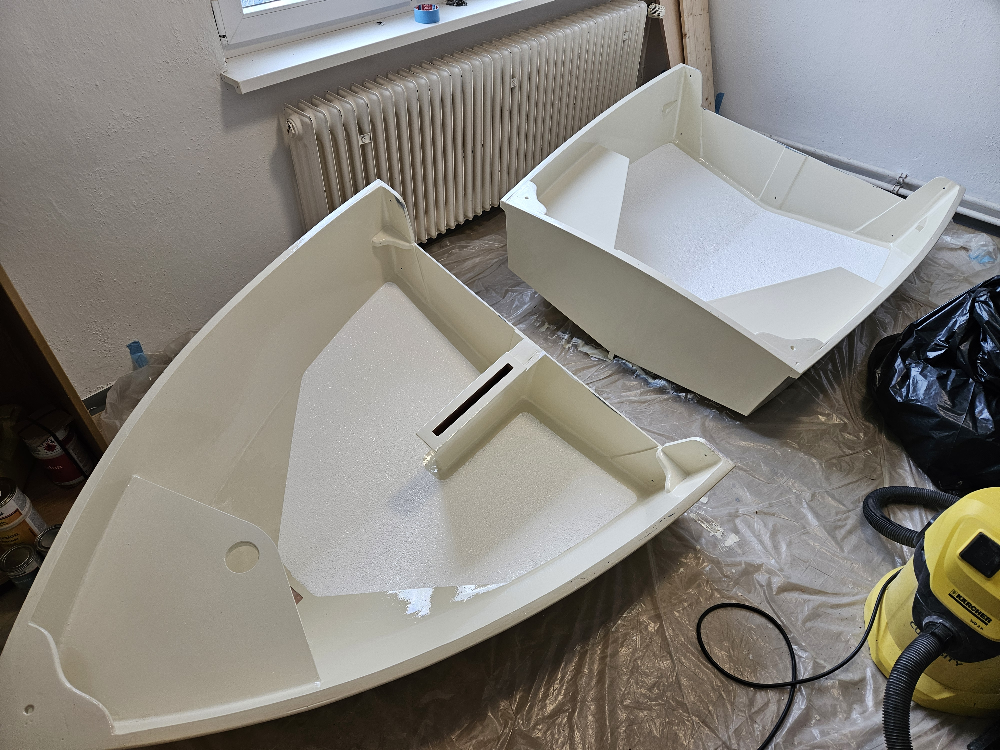 

Now we will let the paint to dry and next week we will attach the hardware for rowing and sailing, and begin the sea (ok, lake) trials.

## Detailed build log

While the build was under way, we documented it on [a thread in B&B builders' forum](https://messing-about.com/forums/topic/15611-spindrift-9n-1579-build/). Here's also the list of what we did and when:

Saturday Jan 6th
- CNC cut plywood
- Buy lumber
Sunday Jan 7th
- Rip and plane gunwales
- Saw and glue transom
Monday Jan 8th
- Glue central bulkheads
- Saw and glue central bench
- Glue king planks
Tuesday Jan 9th
- Rip cleats
- Rip king post
- Rip daggerboard plug
Wednesday Jan 10th
- Buy daggerboard and cradle parts
Thursday Jan 11th
- Move things into the workspace
- Glue the long side and bottom pieces together
Friday Jan 12th
- Sand the glued pieces fair
- Drill and fill nesting bulkhead holes
- Add fibreglass tape to the long side and bottom pieces
Saturday Jan 13th
- Bevel the bottom edges
- Sand transom
- Drill stitching holes
- Glass the butterfly
Sunday Jan 14th
- Build the cradle
- Treated the bow section with hot towels
- Open the butterfly
- Stitch hull, transom, and nesting bulkhead together with zip ties
Monday Jan 15th
- Planed king plank to angle
- Plane nesting bulkhead to angle and re-measure position
- Built and installed breast hook
- Built and installed quarter knees
Tuesday Jan 16th
- Re-measure and install nesting bulkhead
- Gunwales dry fit
- Epoxy gunwales
Wednesday 17th
- Bow bulkhead and king plank test fit
- Tack weld hull
Thursday 18th
- Fillet and glass all inside seams
Friday 19th
- Tack weld aft seats
- Tack weld forward bulkhead 
Saturday 20th
- Fillet and glass aft seats
- Fillet forward bulkhead
- Epoxy paint aft seat insides
Sunday 21st
- Paint inside of aft seats white
- Glass forward bulkhead and epoxy paint inside
Monday 22nd
- Dry fit and assemble daggerboard trunk
- Glue aft trunk tops in place
- Epoxy paint king plank
- Epoxy paint inside of daggerboard trunk
- Install daggerboard trunk
- Round and glass aft trunk tops
- Install king plank
Tuesday 23rd
- Round the outside corners and countersink all holes
- Fillet and glass the outside seams
- Saw the boat in half
- Fill some voids in the nesting bulkheads
Wednesday 24th
- Plane the gunwales to correct height
- Round and sand gunwales
- Round and sand nesting bulkheads
- Cut the daggerboard hole
- Glass the nesting bulkhead outer seams
Thursday 25th
- Cut the thwart into shape
- Build and glue thwart supports
- Insert bronze screws into breast hook and quarter knees 
- Drill hoisting rope holes into breast hook and quarter knees 
- Sand the inside hull
- Glass the bottom and aft seats
- Epoxy paint and glue the bow seat
- Epoxy paint the inside hull
Friday 26th
- Sand the outside hull
- Clean the daggerboard hull hole
- Glass and epoxy the outside hull
Saturday 27th
- Glass in bow eye reinforcement
- Glue daggerboard top cover
- Cut and glue keel plank
Sunday 28th
- Cut keel plank at nesting bulkhead
- Drill and epoxy bow eye
- Cut daggerboard top cover to shape and epoxy
Monday 29th
- Sand the boat 
- Paint primer for the inner hulls
Tuesday 30th
- Paint undercoat on the inner hulls
- Paint two layers of Perfection on the inner hulls
Wednesday 31st
- Paint primer for the outer hulls
- Paint undercoat for the outer hulls
Thursday 1st
- Paint two layers of Perfection on the outer hulls
Friday 2nd
- Paint Kiwigrip on the bottom of the hull insides
