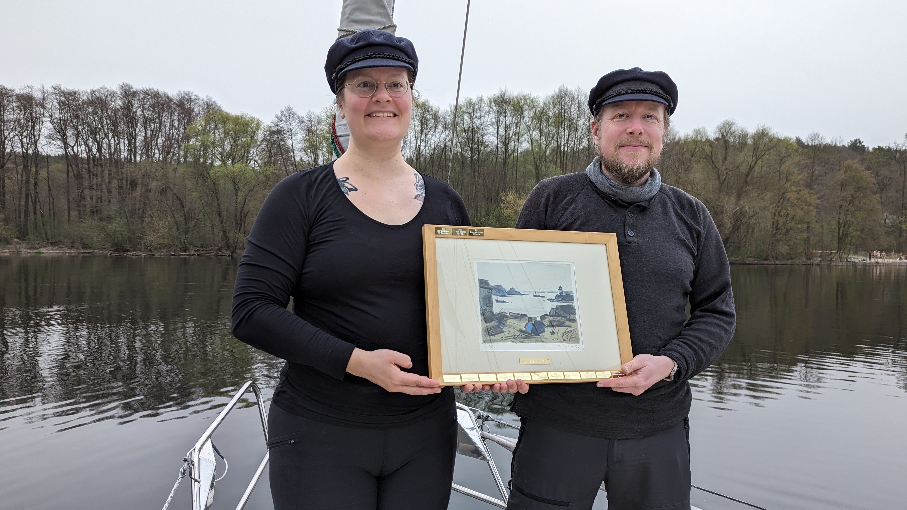
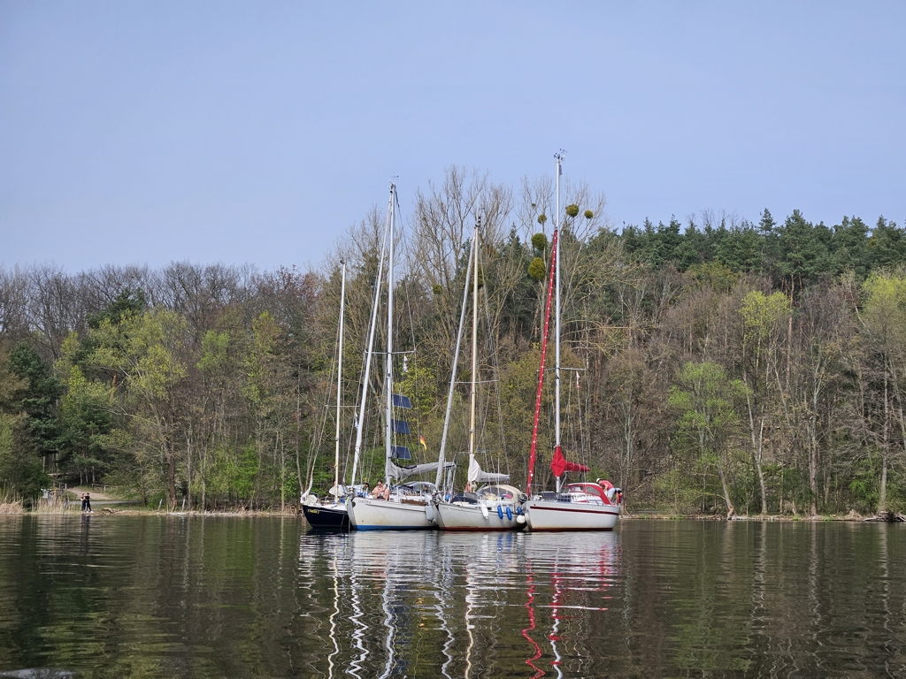
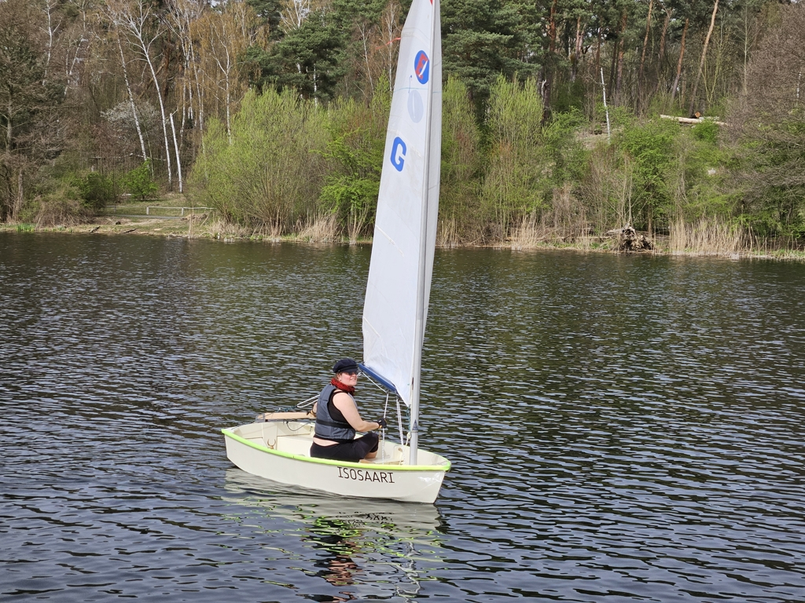

The long project season is coming to an end, and the sun has started shining for a bit longer again. To celebrate, we went out for the long Easter weekend with some of our Berlin cruising buddies.

First stop was the Maundy Thursday gala dinner of the [Schiffergilde zu Berlin](https://schiffergilde-berlin.de/) where we were given the Fünfstern-prize for the [2023 cruise to northern Baltic](https://lille-oe.de/2023/). This prize is awarded for a "sporty and safely conducted cruise to a destination above the 60th latitude".

 

After the gala we moved the boat to the lovely anchorage at Lieper Bucht, where we rafted with three other cruising boats. Over twenty tons of boat behind our anchor!

 

What followed was a weekend of grilling, hanging out, doing some boat projects, and most importantly, giving our new Spindrift 9N dinghy a proper test sail!

 

The dinghy sails very nicely. There are some small adjustments we still should do to the rig, but generally we're very happy with the results. We also got to try using the dinghy for some small adventures to the land, both single and two-up.

On Monday we returned back to Gothia to drop the mast and haul out.
