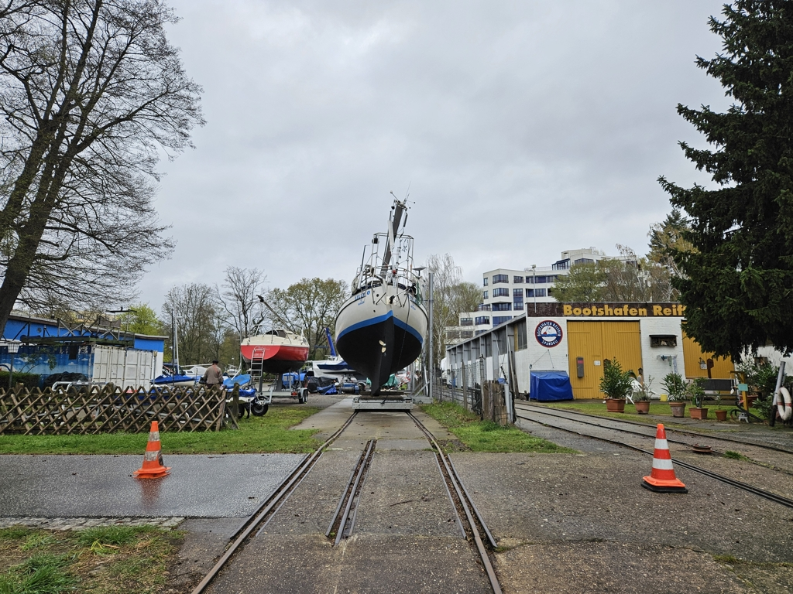

Yesterday we completed the haulout task list, and were able to splash the boat this morning. After clearing the chaos on board that this always created, now we can focus on replenishing the ship's stores for the trip ahead.

 

So, what did we do this winter? Building the Spindrift dinghy obviously was the major effort, but there was also much, much more:

Structural:
- Spindrift 9N nesting dinghy build 
- Rebuild front hatch with 3d core
- Rebuild cockpit floor with 3d core
- A-frame for holding the dinghy on foredeck
- Fix a small dent in the keel
- New coat of antifouling
- Wash and wax topsides

Safety:
- New position lights
- New lead line
- Inreach satellite messenger
- MOB beacons for life vests
- VHF command microphone in cockpit
- New EPIRB
- Fog horn driven by the VHF
- Bilge water alarm by audio and email
- New standing rigging
- First aid course and updated kit
- Celestial navigation course and tables+almanac
- Tidal navigation course
- Diesel engine course and annual engine maintenance
- Marine weather course
- Life vest servicing
- New jacklines
- Add 30m rope to our bow anchor chain to increase anchoring range
- Fire extinguisher maintenance 
- Propeller maintenance and anode change

Sailing:
- Sail storage bag on deck
- Ditty bag and splicing equipment
- Bowsprit for Parasailor
- New telescopic whisker pole
- 3rd reef for the mainsail
- New storm jib
- New spinnaker pole topping lift
- New roller reefing line 
- New main halyard
- New staysail sheets
- New boomvang
- Aluminium turnbuckle covers
- Sailing rig for the Spindrift dinghy adapted from an Europe mast and sail

Electrical:
- Turn solar panels 90° to give windvane more clearance
- Ice maker installation
- Electric dehumidifier for when there is shore power
- Fixed Orca tablet charging by switching from 5V to 9V
- New 12V and USB-C outlets next to all bunks
- Move Orca Core to better position for the digital compass
- Fix saloon bulkhead clock
- Install NAS for the boat, with automatic Google Drive sync
- Move hydrogenerator power switch to more reachable position
- Charging station for Dyson vacuum
- Upgrade to Victron VE.Bus BMS v2 and enable “Sustain” mode for shore power
- Pump for filling water tank from jerry cans inside the boat
- Starlink dishy mounted on pushpit 
- Deck light
- Digital switching for mast lights (anchor, deck, etc)
- DC power for Starlink
- Boat printer
- Upgrade Signal K computer to Raspberry Pi Compute Module 4
- Switch to new more efficient DC-DC charger for alternator

Other:
- Darkening curtain for the companionway
- New easily deflatable and stowable fenders
- Tools and spare parts reorganisation and storage
- Fabric and fibreglass storage rack
- Boat stamp
- Head match holder
- Set of courtesy flags and some custom ones
- New mosquito net for the front hatch
- Small item storage box under the sprayhood

As always, we didn't complete everything on our winter list. This means there are still things we need to do either under way to Szczecin, as well as things we can do when anchored and waiting for weather.

If everything works out, we'll head out on Saturday morning. Right now the weather forecast looks like summer in early April.
