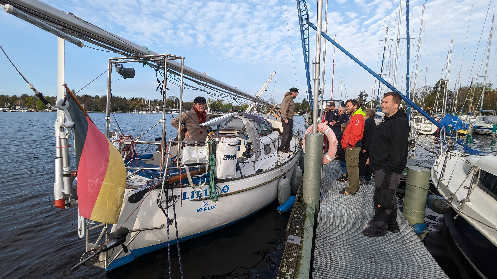
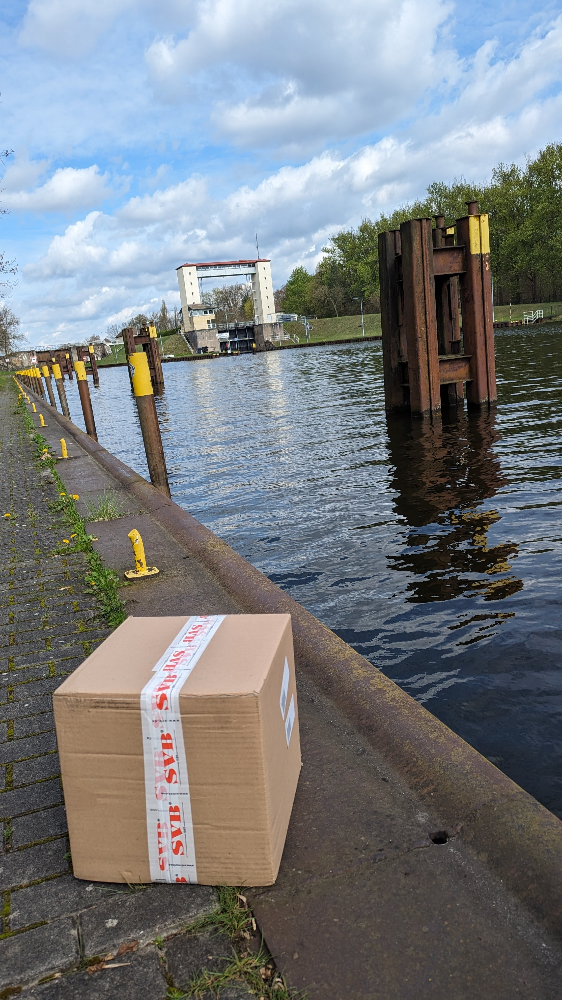
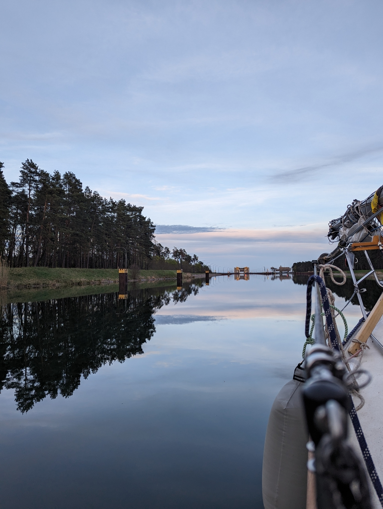

Morning started with last of the packing and a breakfast at the Gothia terasse with our local sailing buddies. Coffee, croisants and various pastries were consumed before firing up the engine and going through the last checklists if we had forgotten something. Based on the lists we were all set to leave and we were sent off with a cacophony of fog horns! The voyage had started!

 

While motoring out we got notified that the last, delayed chandlery parcel had finally arrived. A bit too late. Luckily Karin was able to pick it up and deliver it to us to the Lehnitz locks! We are thankful for such amazing friends.

 

Lehnitz locks are always exiting as the basin is filled with speed, so the ride is always somewhat turbulent. After the basin was full, the lock keeper came out to the balcony and we had a lovely small chat with him. 

After Lehnitz it was time to continue with the projects, now that we had the final missing pieces. Deck got couple of new holes which were epoxied close so that later we could drill smaller holes without danger of getting the core wet.

 

At 19:30 we arrived at the ship elevator and were let in 30min later. The ride down brings a smile to our faces every time. It is such an epic piece of engineering! We moored at the sport-boat waiting area and finished up the projects we started at Lehnitz. Now we have a secure mounting spot for the Isosaari mast on our deck!

* Distance today: 44.7NM
* Total distance: 44.7NM
* Engine hours: 9.6
* Lunch: Feta salad
