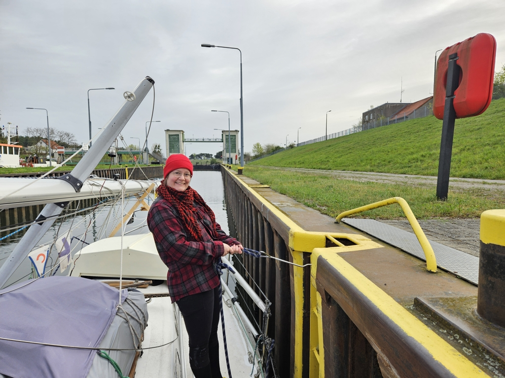

We left the ship elevator sport boat dock at sunrise, and started our journey through the Oder river valley.

 

We cleared the Hohensaaten locks quickly with a private locking. After that it was a nice leisurely downstream run. Whilst yesterday we had to go against a current up to 1kt, today the stream was speeding us along by 0.5-1kt.

 

The summer weather was still on, and Suski got a good number of bird sightings to her records. The nature reserves along the channel can be quite picturesque.

At Szczecin we crossed the newly built railway bridge (6.2m clearance instead the 2.9m of the old!) and arrived to the old familiar AZS marina. Sadly this time their mast crane isn't available until the end of the month, but we were able to to book the crane of the neighbouring marina for tomorrow.

After 203 days, we're back at the sea!

* Distance today: 50NM
* Total distance: 94.7NM
* Engine hours: 9.3
* Lunch: gazpacho
