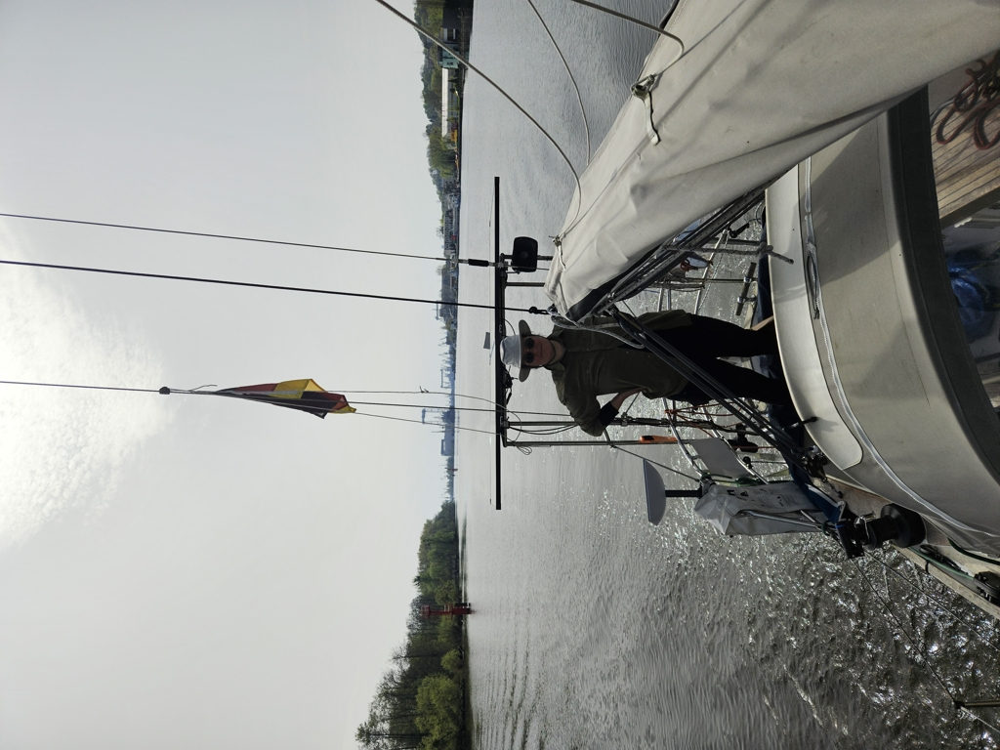

The day started early with hoisting up the mast. We moved over to the crane and prepared all tools and removed all now unnecessary ties from the mast. Only few hours later, the rig was tuned and all sails were on. We are a sailboat again!

 

We started the long motoring towards the sea. With practically no wind and summer temperatures we trucked along. As the path grew wider, we decided to turn on the autopilot, but it behaved badly. Steering us in weird direction. So what was supposed to be a  off watch for Bergie turned into a debugging session.  What did we change over the long winter and how could it affect our system. After couple of hours Bergie figured it out. We were feeding too much information to the slow processor of the ST4000+ and the information overload made it mad. After the amount of data was brought back to a level the processor could handle we were yet again steering in  straight line!

 

As the day grew old the summer temperatures were being replaced with cooler spring ones and the T-shirts became long sleeves and the long sleeves a woolen shirt. Sailing much more like we know it. 

We checked the last weather forecast and decided to give Swinoujscie a miss and proceeded straight into the light breeze of the Baltic. We hoisted the sails in the protection of the wave break. A night sail is a proper way to start the season at the sea!

* Distance today: 38 NM
* Total distance: 132.7 NM
* Lunch today: wraps
* Engine hours: 8
