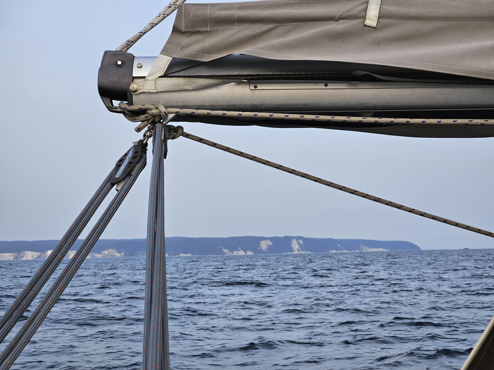
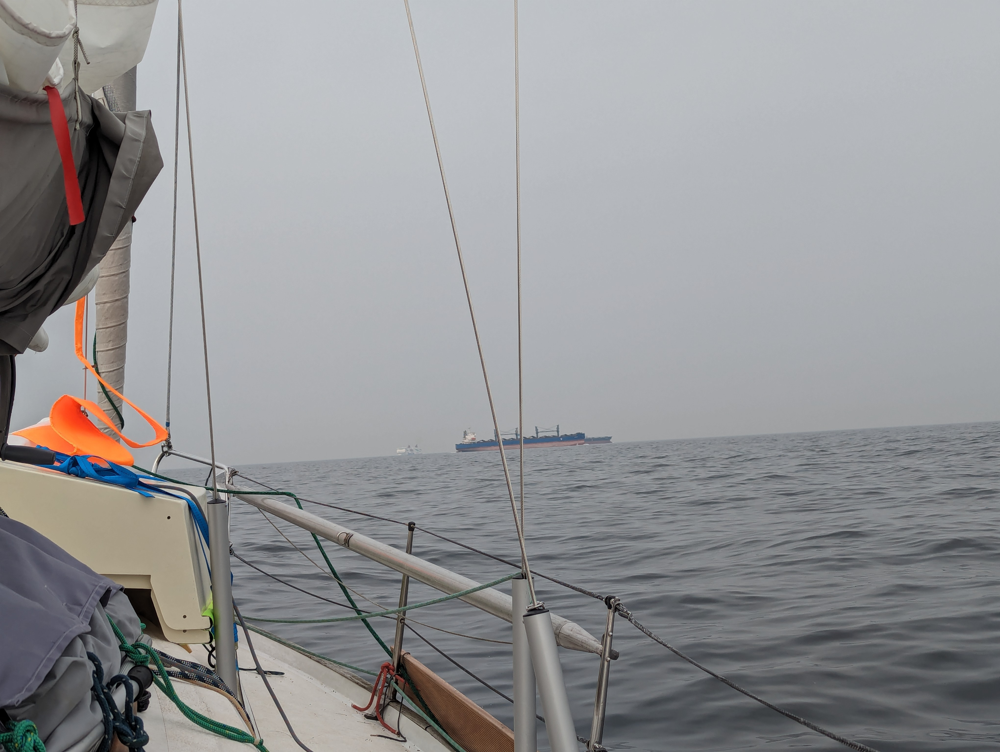

The first night's sail delightful under a starlit sky. Very little traffic, and a nice slow broad reach got us abeam of the island of Rügen and the scenic Königsstuhl cliffs at sunrise.

 

With the increasing wind, we were able to steer most of the day with the windvane. The main traffic lanes of the Baltic worked out nicely, with us only having to do a slight course change to avoid a fishing trawler.

 

In the afternoon we found ourselves between two fronts. The rapid 180° wind shifts combined with the short sharp swell meant that we decided to take the sails down to stop them from banging. We then proceeded on a rolly course under engine until the weather situation stabilised to the new westerlies.

From there we could enter the Øresund strait under sail.

* Distance today: 106NM
* Total distance: 276.7NM
* Engine hours: 4.9
* Lunch: chanterelle risotto
