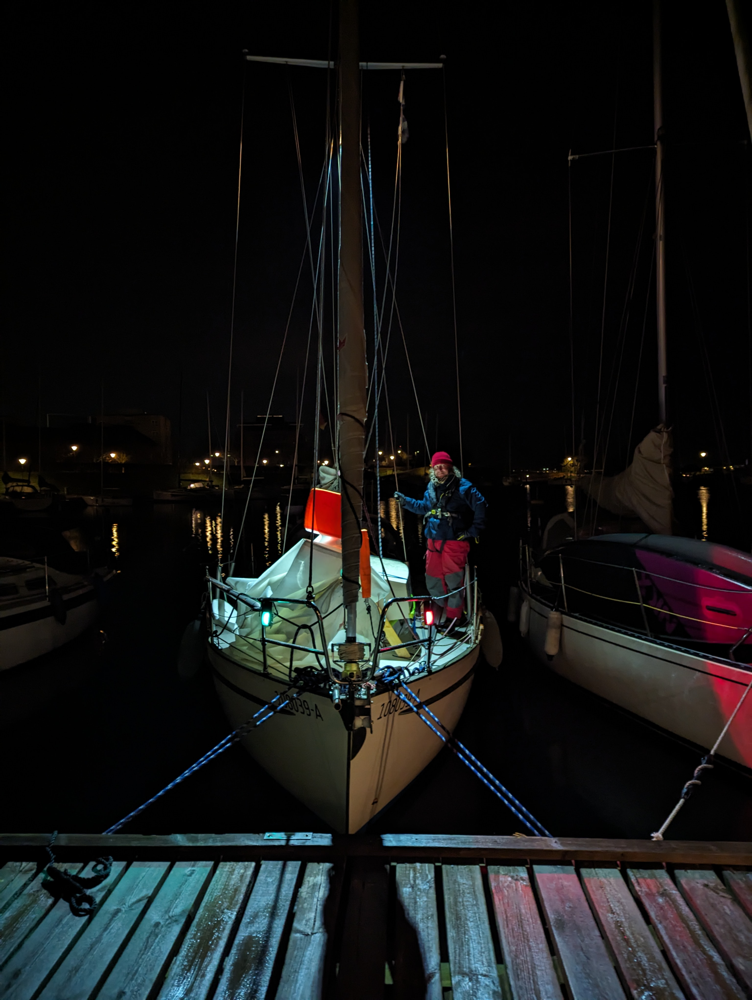

Sailing lasted for about 4 hours until the wind died again. At this point we turned on the motor and headed in to Copenhagen. Entering a new harbour at night is always exiting. 

First we checked from various internet sources does the harbour have street lights around it (yes). Then we checked various announcements (the Lynetteløbet canal is closed till the end of the year). And then we checked the route for any mistakes (few points where the route went close to a buoy). With this information we were confident we could make it. 

Night arrivals require all hands on deck. One steering and one reading the map and spotting buoys based on their blink pattern or finding them with the flashlight (all hail the reflective stripe at the top of buoys). With this combination and reduced speed we can be sure of our location at all times. 

At the harbour entrance we first drove by it to see behind the wave break. Even if you have seen the place in images and maps, your own eyes verify what you thought you had seen on your sources. After this we entered the harbour, found a spot marked with a green sign for vacancy (also reflective) and caught the aft buoy and secured ourselves to the pier with lines from the bow. 

 

We'll keep the weather here for couple of days. Now it is time to have an 'anleger' (Kippis Karsten!) and get some well earned sleep.

* Distance today: 23NM
* Total distance: 299.7 NM
* Lunch today: maybe a hot dog in Tivoli later
* Engine hours: 2.8
