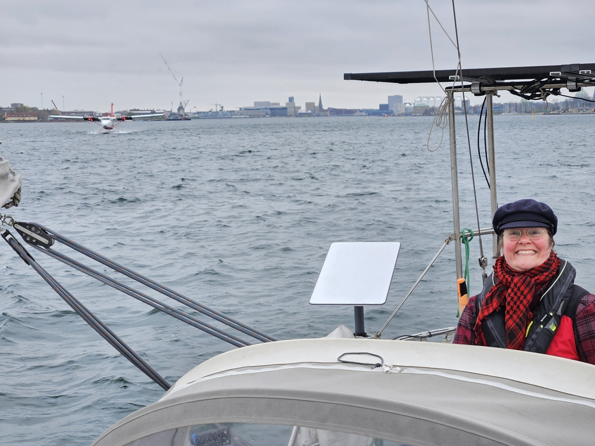
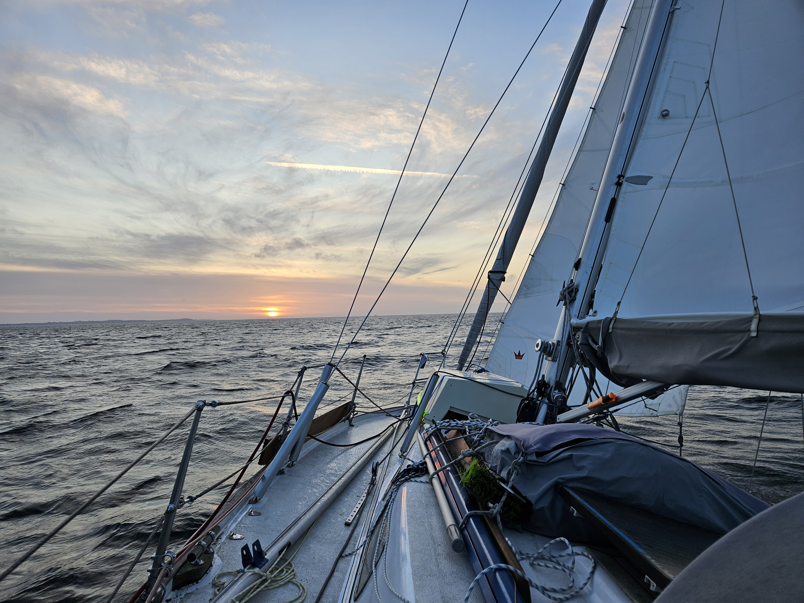

We spent a lovely tourism day in Copenhagen - toast skagen, looking at the historical sailing vessels in Nyhavn, the bog bodies and sun disk at the National Museum, and finally some wandering around the beautifully lit Tivoli gardens. 

In the morning we tried debugging our [VHF interference issues](https://community.victronenergy.com/questions/276162/orion-xs-safe-vhf-antenna-distance.html?childToView=276135) with the new Orion XS DC-DC charger. Issue still unresolved, but with more information, we grabbed some pizza and headed north. 

 

One exciting point when departing the Copenhagen harbour was when a float plane overtook us!

Nice strong breeze in the Sound carried us along nicely. At the Helsingør narrows we had to contend both with the heavy ferry traffic, and a 1kt countercurrent.

Now at sunset watch change, we're finally in a new sea area. Kattegat opens in front of us, giving promises of the beautiful archipelago that starts around Gothenburg.

 

* Distance today: 29NM
* Total distance: 328.7NM
* Lunch: pizza
* Engine hours: 0.7
