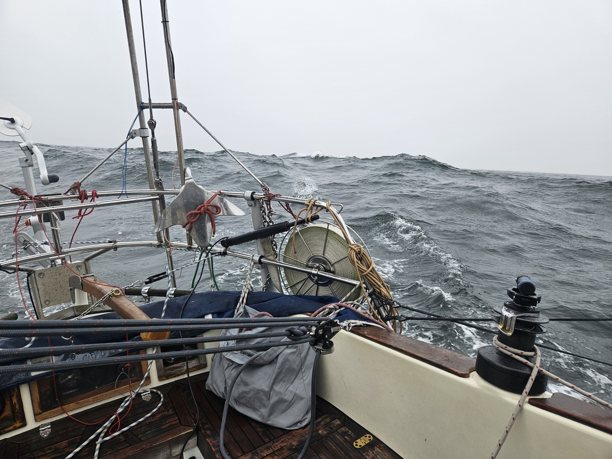
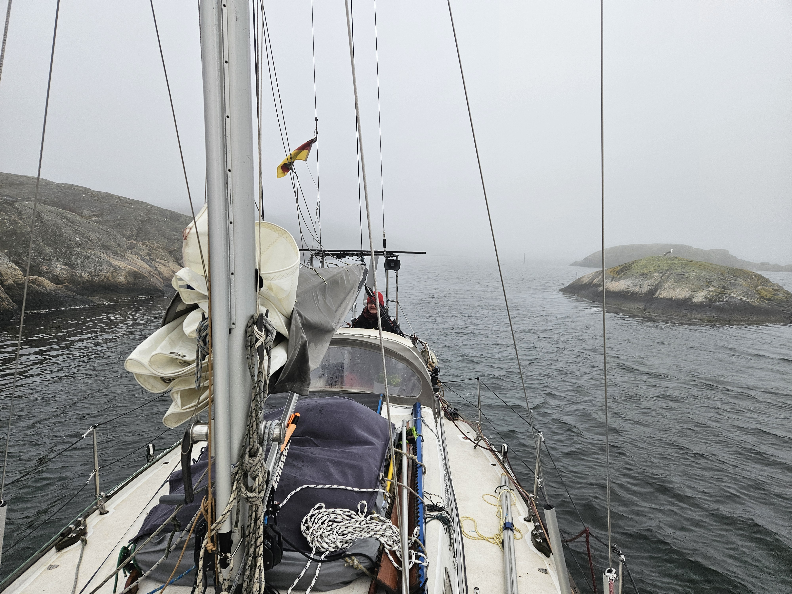

Weather prognosis held true, 20 kn gusting to 30, waves around 1.5 meters. Wind beam to broad reach for us, so a perfect opportunity to head towards Sweden and the Archipelago on the west coast. The weather called for staysail and main in 1st reef. We were expecting a fast and bumpy ride and we got it. 

 

With these conditions there is no 'chilling' while on watch. As the there is still not that much sea room and there is quite a bit of traffic, one must keep to boat steering straight even with the constant wind shifts and an occasional 'mama wave'.  The bit that the weather forecast got wrong was fog, but the newly installed loudspeaker did its job and gave the correct loud noise with the correct intervals.

As the amount of daylight is still a finite resource we had planned diversion options to turn towards when it was about to get dark. This time the fog was the decision maker, and we turned it slightly before sunset. The last bit we motored between the extremely narrow fairways between the rocks with maybe 300m visibility, and are now moored at a SXK buoy.

 

We have put the first 7 days of our journey into good use!

* Distance today: 122NM
* Total distance: 450.7NM
* Lunch: lentil coconut curry
* Engine hours: 0.8
