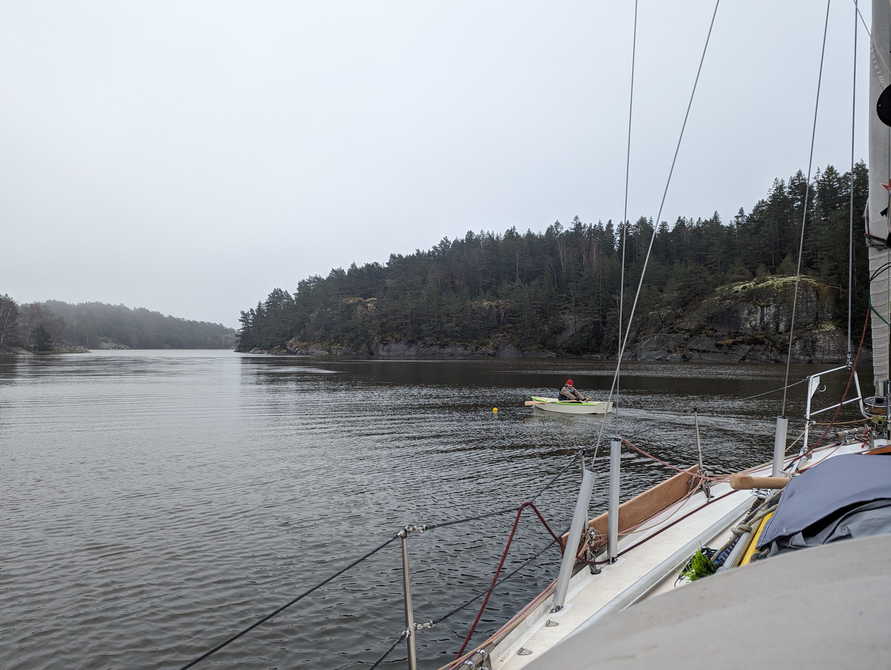

At sunrise we woke up to a drizzly, misty weather. Heavy weather was on forecast, and after many consultations with charts and satellite pictures, we had picked our storm hole. So, motor on and release the boat from the buoy.

 

Since outside it was quite rolly, we motored along the narrow winding inside fairways to reach the north end of the island of Orust. This allowed us also to slightly top up the batteries before the gale ahead.

Our initial plan of using one of the SXK buoys at Dragsmark didn't work out, as the local marina had apparently decided to stash their derelict sailboats on those. Bummer. But after a bit of search, we found an even more protected spot to anchor just behind the corner.

 

Jon from Norway was coming to join us for the weekend. So it was time to assemble Isosaari and row the 1.5km to the nearest pier. Turns out the dinghy can carry two people and a ton of gear, even in 25kt wind!

* Distance today: 23.6NM
* Total distance: 474.3NM
* Lunch: spaghetti bolognese
* Engine hours: 5.1
