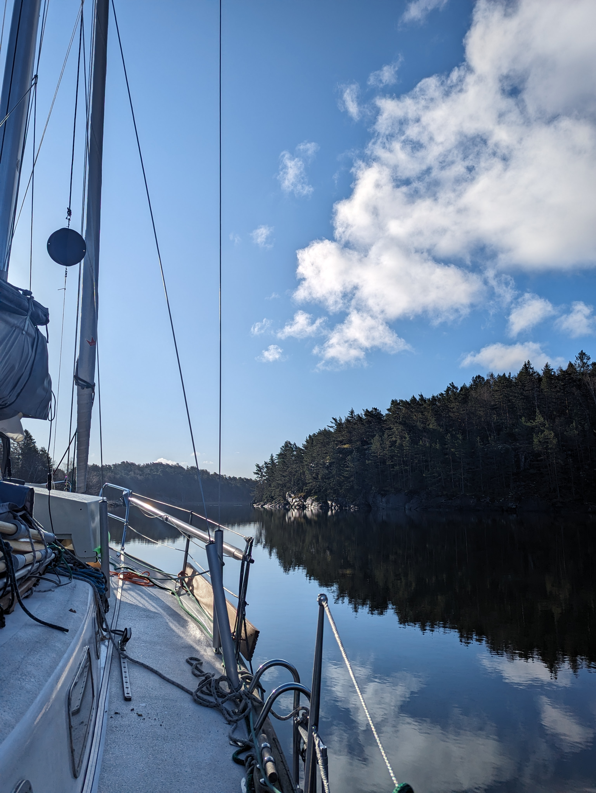
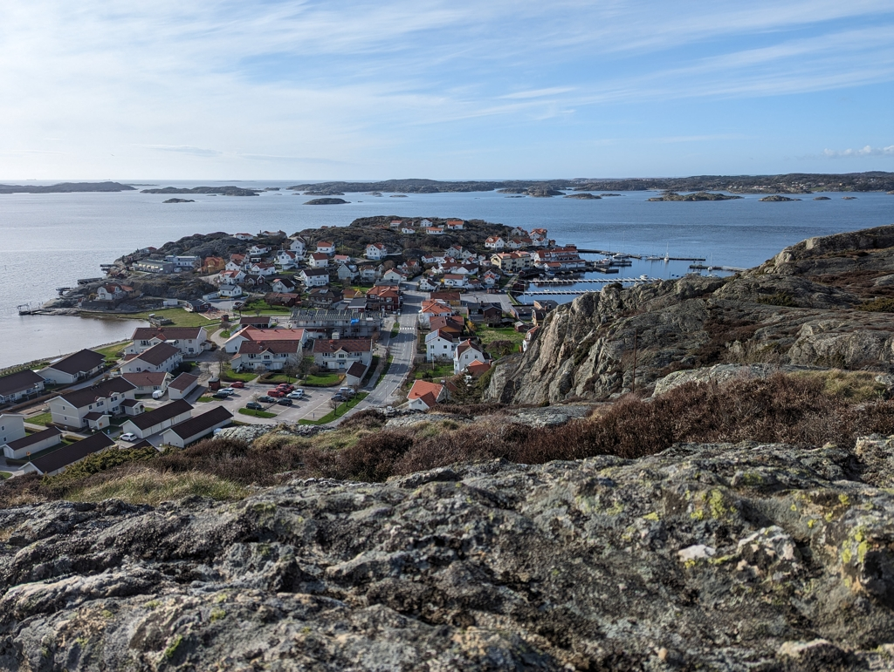

Morning started relatively early as we needed to get Jon to shore before his first meeting. We enjoyed the breakfast outside in the glassy calm that was the weather after the storm. Our anchorage proved to be a nice shelter. Yesterday we saw only 20 kn gusts instead of the 48 that the closest weather station reported. 

 

We motored back towards the open sea and encountered our first tiny counter currents. On few narrow passes we had 1.5 knots against us. We approached the Ellös guest harbour carefully and were surprised by slime lines on the inside side of the guests pier, so Suski reversed back out for Bergie to have enough time to get working gloves for both from inside. As we started to make our second approach a fishing vessel started maneuvering in the harbour and we circled one more round before getting in. The slime line was truly that. Slimy and full of life, so taking the time to go and get the gloves was a very important indeed. 

Afterwards we took a stroll to the Hallberg-Rassy boatyard and hiked to the viewing point of the village to get a proper look at the harbour(s).

 

* Distance today: 7.8NM
* Total distance: 482.1NM
* Lunch: Swedish meatballs and potato salad
* Engine hours: 2.2
