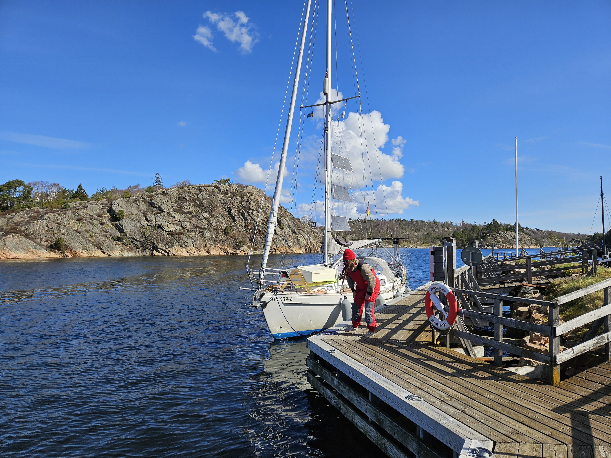
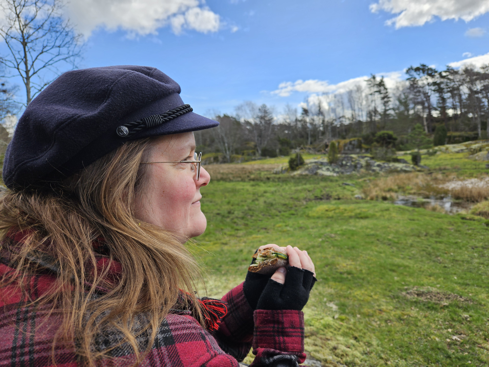

At Ellös we ended up chatting with our dock neighbour. He had a very similar boat to ours, a 31ft double ender that he had sailed around the world, including Cape Horn. He recommended the island of Bassholmen as our next destination. 

The fixes Jon made on the weekend to our DC-DC setup seem to have helped with the VHF interference. To test that further, we motored up to Bassholmen through the narrow rocky channel. Three ospreys were sighted, and we verified that indeed we can run the boat's dehumidifier while motoring. Might become handy when we get to the wet parts of Norway.

 

At Bassholmen we tied up to the pier of the local guest harbour. The harbour opens when the season begins in May, but with our watermaker and solar panels, we should be fine for a while.

There is an old boatyard on the island that has been turned into a museum. Whilst the museum is closed for the winter, they have some of the old fishing sailboats docked outside. The family resemblance with our Lille Ø can't be ignored!

 

We'll cook dinner at the fire pit later, and so for lunch we made some sandwiches to be enjoyed at the local nature trail.

* Distance today: 4.5NM
* Total distance: 486.6NM
* Lunch: sandwiches
* Engine hours: 1.3
