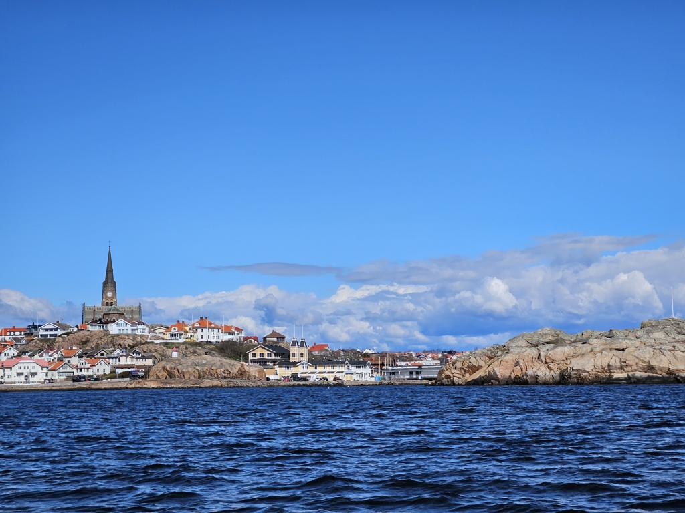

# Skagerrak, 10.8 NM NW of Bassholmen

After waking up we started a project morning. We added a new filter to the water maker and water filter and finally added the runner gasket to the front hatch. After all things were done, we said goodbye to the lovely Bassholmen and headed towards Lysekil to fill up our diesel tank. We are expecting some cold weather for the next week, so reserves need to be full to be able to run the diesel heater at anchor.

We asked around a bit for an active station as we don't want to be the first boat fueling on a remote location and get the stale diesel that had been sitting on the tanks for the whole winter. We rather go for a place that has seen active use for the whole season. As from now on our diesel will sit in the tank for longer and longer as the need for heating is less and possibilities for sailing better!

 

After filling up we came to a SXK buoy right at the edge of the archipelago. Now it was a waiting game. Which will come first, the expected windshift or darkness? After so many days of just motoring between the islands we want to see the open ocean and sail a bit.

Darkness was trying to win, so we cheated and left before the expected windshift. Now we are not making our optimal course, but we have cleared the last of the rocks and have the full Skagerrak in front of us. Suski is down below trying to get some sleep as Bergie is taking the first watch.

 

* Distance today: 10.8 NM
* Total distance: 497.4 NM
* Lunch today: makaronilaatikko 
* Engine hours: 2.5
