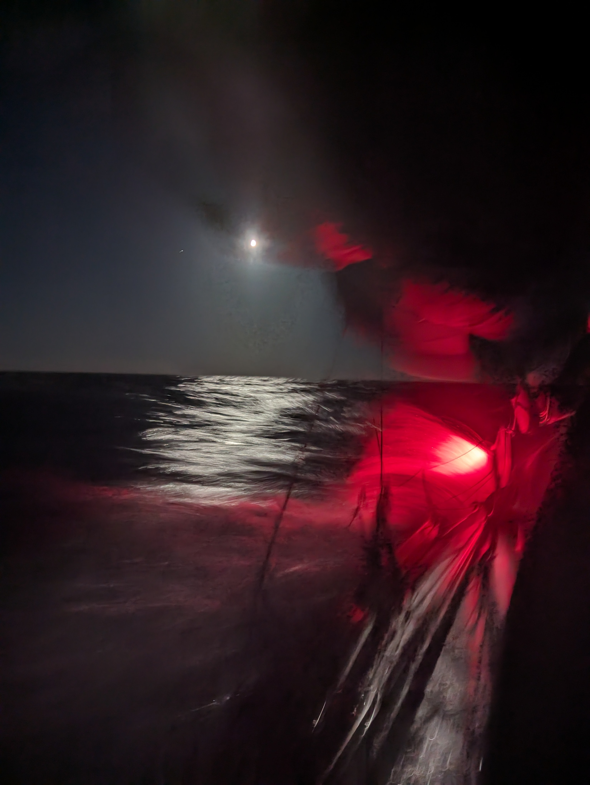
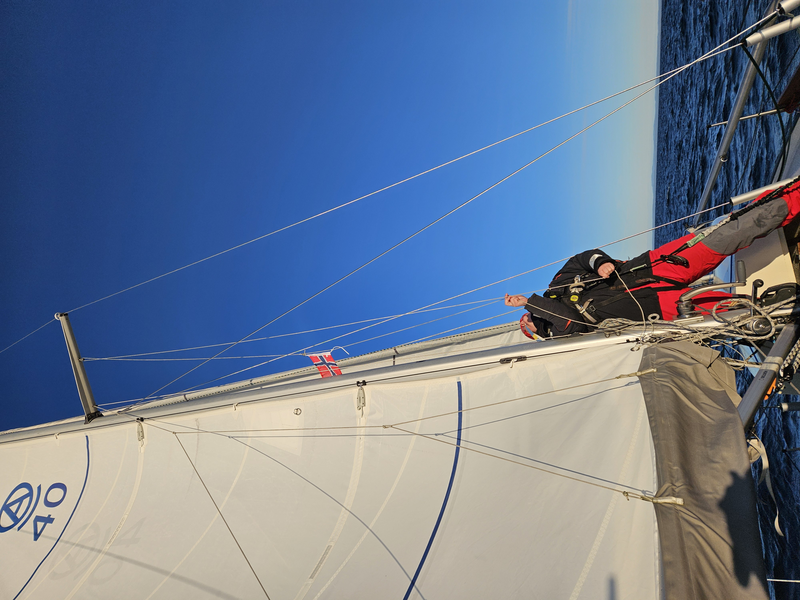

Based on the forecasts, we expected a nice easy night sail across to Norway. The forecast got some parts right. The wind direction was spot-on, as was the current. Wind strength, on the other hand...

Almost immediately after we had hoisted sail and settled into our watch routine, the wind started picking up. Soon we were at the forecasted top of 14kt. Then 20kt, 25kt, and rising. Eventually it settled to 36kt. And - not expecting that - we were carrying full sail with some difficulty. As the autopilot failed to cope, the boat was hand-steered downwind and Suski roused from bed.

Once we had the genoa rolled down to a sliver, and the main on second reef, things got a lot easier and we could get back on a westerly course. The big winds kicked up quite angry seas, and the deck and cockpit were constantly washed with salt water.

 

After about two hours, the winds started getting to more reasonable numbers, and we could roll out the genoa again. Waves were slowly getting more reasonable, making even some sleep possible off-watch.

 

At dawn we were greeted with a sight of the snow-capped mountains of the Norwegian interior. Sun shone on a clear sky, and we turned towards an anchorage at an easy broad reach. Soon, we were navigating the picturesque rocky coastline and preparing to drop the hook. Norway!

* Distance today: 81.6NM
* Total distance: 579NM
* Lunch: cheese and vegetable wraps
* Engine hours: 0.3
