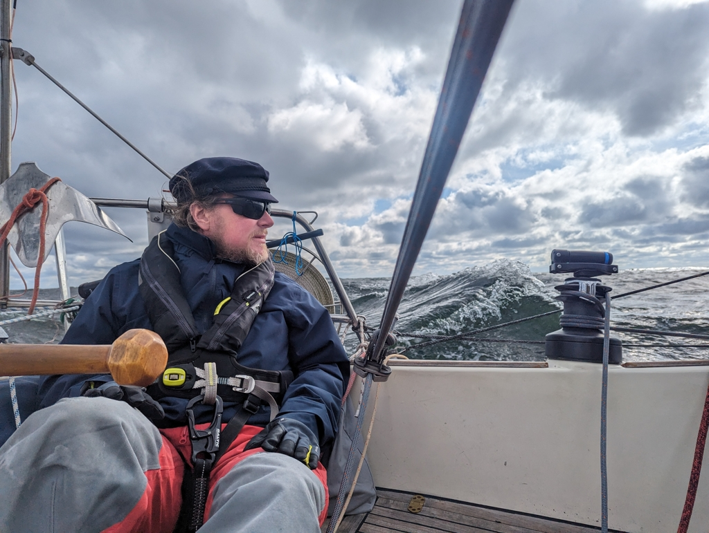

# Dalskilen - Mandal

When the winds are favourable, one must sail! 

We started the motor just before 8 and headed out of our tiny and protected anchorage. We chose as the route the easy exit to open ocean after a 9 nm of protected in-shore sailing. The plan was to hitch a ride on the current that runs along the coast of Norway towards Lindesnes. And oh boy did we get a ride!

 

Big waves, 1 to 2 knot current and wind around 20 knots meant that we had main in first reef and the staysail, the standard setup for this trip it seems. The beginning required a bit of getting used to and getting the settings on the windvane. The big waves meant that we couldn't go as straight downwind as normally. But we rather go higher to the wind and avoid accidental jibes. 

 

Nevertheless we were running wing on wing. A preventer and a poled out headsail where the pole has it's own double preventer means that anything between 150° to 180° TWA is doable. And the waves meant that we needed that range.

 
(Yes, Suski is up to Suski kind of shenanigans while preparing the port side preventer in anticipation of the last 5 miles of gybing between the islands)

With this combination we rocked the fastest day with  Lille Ø. Top speed at 10.1 and average speed at a whopping 7.2 knots! Our ould lady can be whipped into amazing feats, as long as you plan correctly and dare to take on the open sea!

We are now in Mandal harbour as the website promised it is open all year round. A warm shower, doing laundry and getting rid ouf our trash has been long awaited and is finally now possible.

* Distance today: 66.5 NM
* Total distance: 645.5
* Lunch today: rye bread sandwiches
* Engine hours: 0.8
