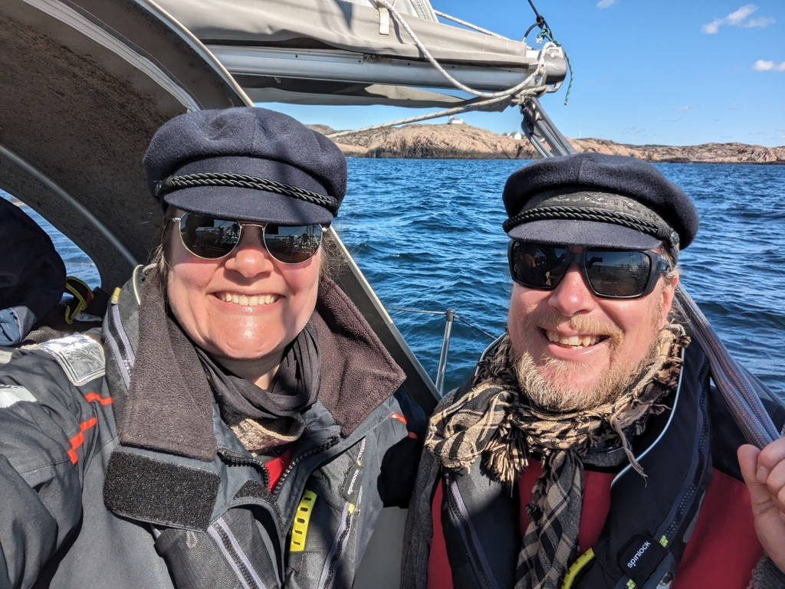
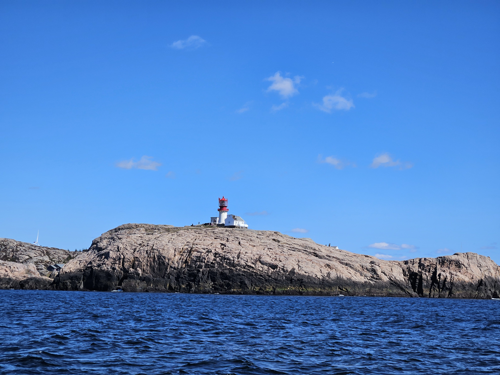
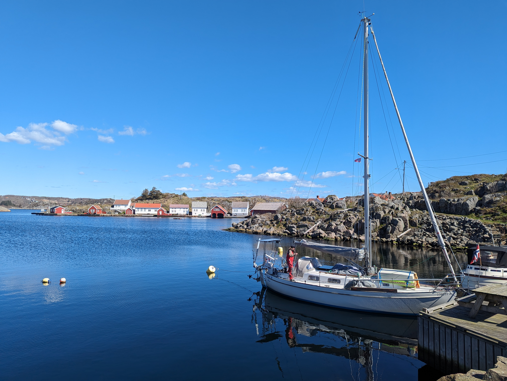

We were waiting for a good weather window for rounding the famous Cape Lindesnes - the southernmost point in Norway. Today it all matched up: low but sailable winds, small waves, and wind with current. And so we filled our water tank and headed west under full sail.

The veering wind meant that most of the day was sailed under a poled out genoa at more or less dead downwind. Apart from a short lull that made the sail slat, we had a wonderful sail among the coastal rocks.

 

We rounded Cape Lindesnes a bit before 1pm. With the light conditions we decided to steer so we'd get a good look at the lighthouse. It was just us and a ton of weekend fishermen out there.

 

After Lindesnes we picked the very protected bay of Seløyhamn for today's stop. Here we are tied with a stern buoy to the pier of the outdoor recreational area. Reputedly this bay was used as shelter by multiple viking fleets.

 

* Distance today: 18NM
* Total distance: 663.5NM
* Lunch: Couscous salad
* Engine hours: 0.6
