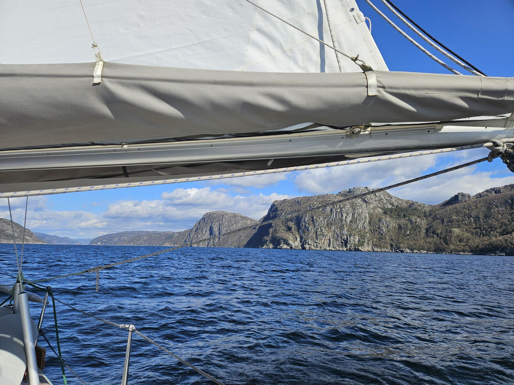
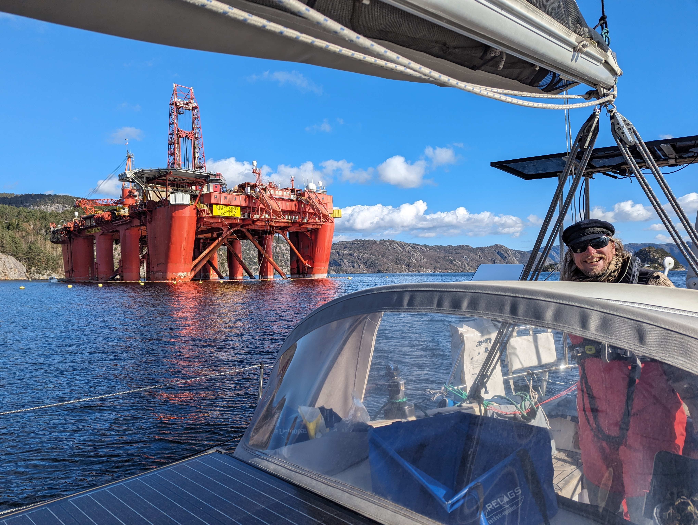

Day started with slow winds as we motored out of the harbour. After we had passed the narrow fairway out, we deemed the 5kn of wind to be enough to sail with. The sea was nearly waveless and we could use even the lightest winds to sail further with a comfortable crawling speed. It doesn't always need to be high winds and adrenaline.

As the wind slowly increased in speed, the wind veered so we needed to gybe.  We hoped to make it past Lista before the wind would greet us dead on the nose. We managed in this and so far we haven't needed to beat into the wind even once! The pilot charts have been true so far. Though the price for favourable winds has been the temperature. It is chilly when sailing if the sun isn't shining.

After rounding Lista we turned dead downwind and headed towards Flekkefjord. The first of many fjords I hope. Even though this is a tiny one the proportions of the place blew us away. You feel like a tiny ant between the tall mountains!

 

As we ventured deeper we saw something big and red near our harbour for the night. Sometimes tall island would hide it but as we turned the last corner we saw it in its humongous completeness, an oil rig. It seems they have brought it here to demolish it completely after nearly 50 years in comission.

 

Tomorrow well stay here and work in some boat projects as the weather out at sea is prognosed to be a bit sporty.

* Distance today: 30.1NM
* Total distance: 693.6NM
* Lunch: spaghetti aglio olio
* Engine hours: 1
