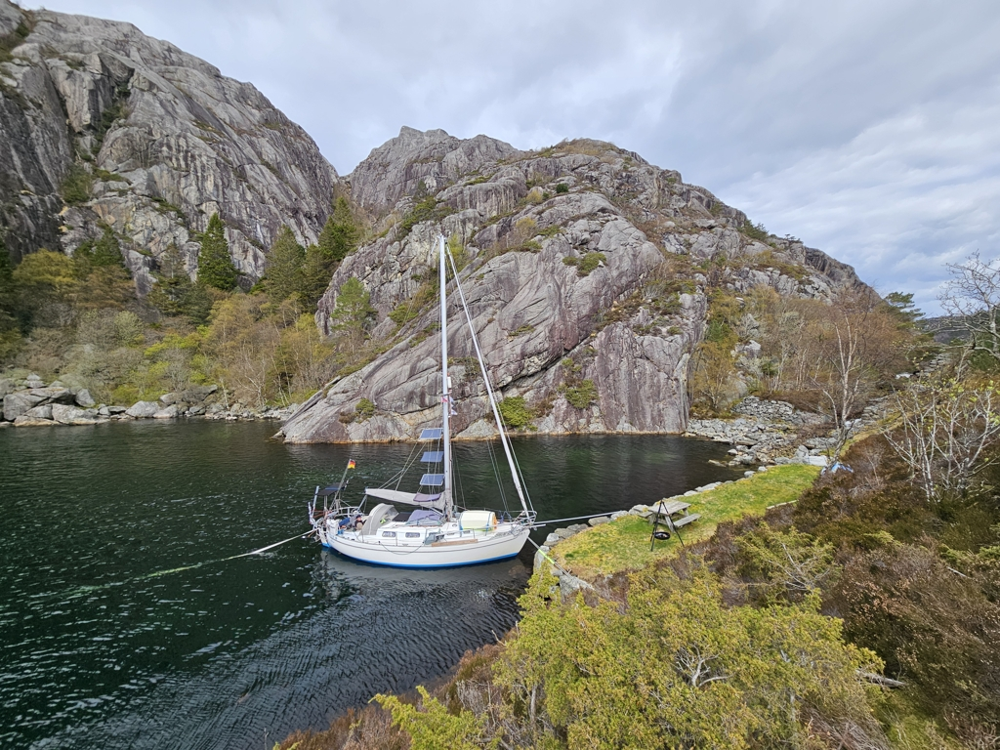
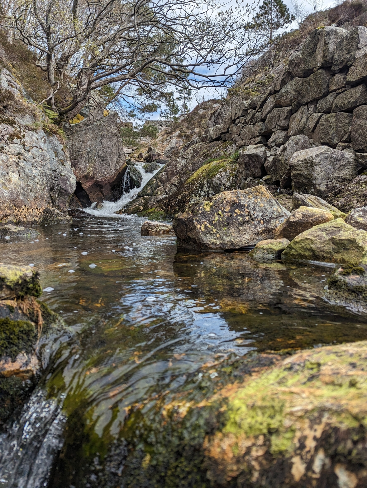

Yesterday's project day went quite nicely - both of the electric bilge pumps are now installed. Suski also built a new grating to cover the cockpit drains.
In the evening the rain ended and we enjoyed making some pancakes on a fire and well deserved project beers, thanks to Karsten.

The forecast has again better winds for the end of the week, and to capitalise on that we motored today out of the Flekkefjord to an anchorage just outside. Since the sea is warmer than air right now, this should also keep the night temperatures above freezing.

 

And what an anchorage this is! A protected bay surrounded by impressive cliffs. We are moored with the stern anchor to the small pier. Right next to us there is a picturesque waterfall.

 

* Distance today: 9.5NM
* Total distance: 703.1NM
* Lunch: oven feta pasta
* Engine hours: 2.4
