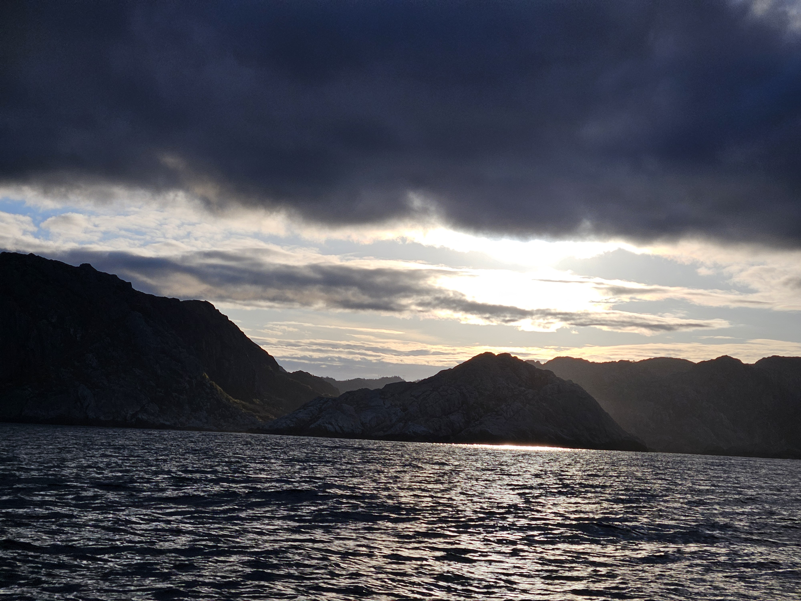
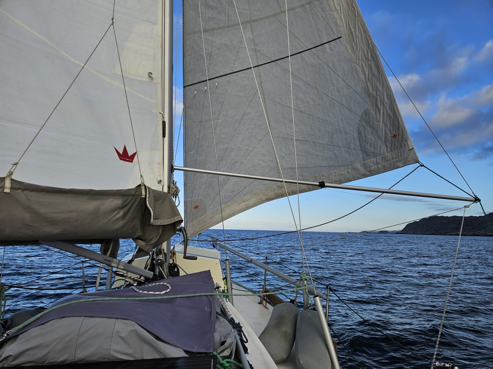

We woke up an hour before the sunrise to be able to start at day break. We motored quietly out of the beautiful anchorage and hoisted the main inside the sheltered bay. We motor sailed out and waited for the wind to decide from where it is coming before rolling out the genoa. We made slow and steady progress aided by the 1- 1,5 knot current.

 

At the height of Eigerøy lighthouse the wind stopped completely. As we saw small rain clouds all around us we decided to motor the last 4 NM and not get wet. We found the town dock without any hassle and tied alongside. We ate lunch while sitting in the cockpit and when we were done, the rain started. 

 

Now we are looking forward for a cosy afternoon below decks reading books. 

* Distance today: 26.6NM
* Total distance: 729.7 NM
* Lunch today: pea soup
* Engine hours: 1.2
