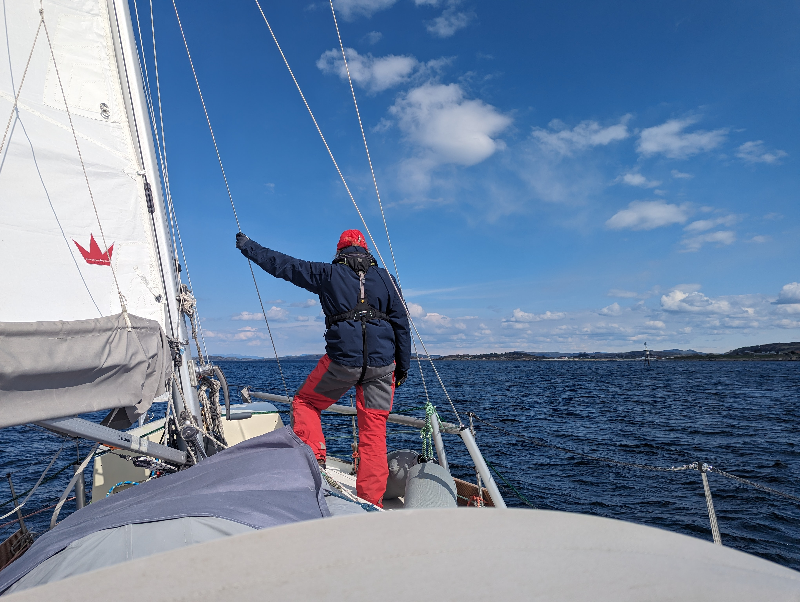
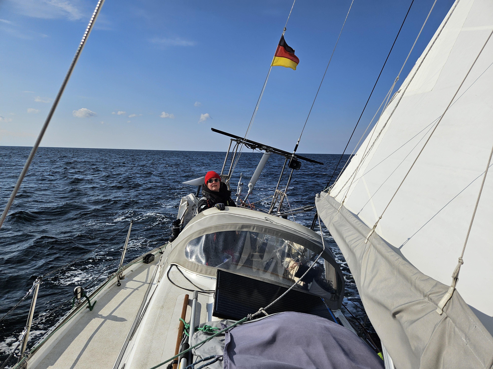

The weather forecast promised a bit frustrating passage past the shallows of Jærens Rev. First some downwind sailing, then windstill, and finally short tacking in sleet. Luckily for us, forecasts can be wrong.

We left the industrial fishing harbour of Hellvik at sunrise. Wind picked up quickly, and soon we were blasting down on a broad reach and aided with a nice 1kt of current.

 

The landscape here was flat, quite reminiscent of Denmark or southern Sweden. We took turns on watch and having a nap.

Rounding Jærens Rev, the wind picked up even more instead of dying down. We kept going at hull speed, and soon rerouted ourselves to a harbour a little bit further along.

 

At the entrance to the Stavanger Bay the wind turned more to northeast, and we decided to take the first tacks of this trip. A grand total of two brought us to our destination, the small recreation island of Line. Seems this place is popular with the locals, as the pier filled up just half an hour after our arrival.

Now that we've reached the fjords of Rogaland, we'll shift from passage mode to coastal cruising. The good chance of easterlies in April that [pilot charts](https://prevailing-winds.de/) predicted has worked out. We've done the trip here from Berlin in three weeks, with wind behind the beam the whole time.

* Distance today: 46.2NM
* Total distance: 775.9NM
* Lunch: spaghetti with tomato sauce
* Engine hours: 0.7
