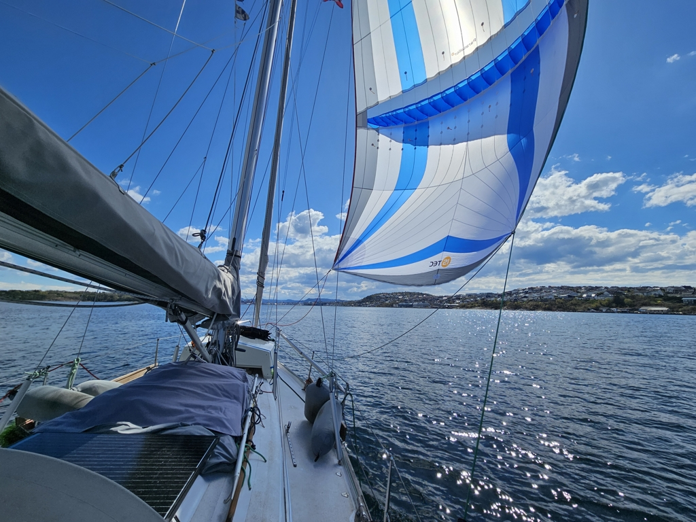

What we thought was a full harbour became even fuller as the evening grew older. At the end there were 10 boats on the tiny pier, some rafting up together, some coming in with stern anchor and tying the boat to the pier only from the bow. We enjoyed a lovely evening talking to our fellow boaters getting a lot of good tips where to stay and what places to avoid.

 

After sleeping in, we started preparing the boat for a slow day of spinnaker sailing. The first time trying the new setup with the bowsprit. After remembering how all the lines run, we motored out of the pier saying our goodbyes and proceeded to hoist the spinnaker up. And it all worked as planned! Gybing was easier and we could fly the sail with better control. It is lovely when a plan comes together.

 

We sailed under the spinnaker, until fairly close to our destination the wind died and turned about 80 degrees. We quickly doused the spinnaker and turned on the motor to go the last half a mile to our chosen destination. A shower and some sightseeing is our plan.

* Distance today: 4.9 NM
* Total distance: 780.8 NM
* Lunch today: lentil coconut soup
* Engine hours: 0.7
