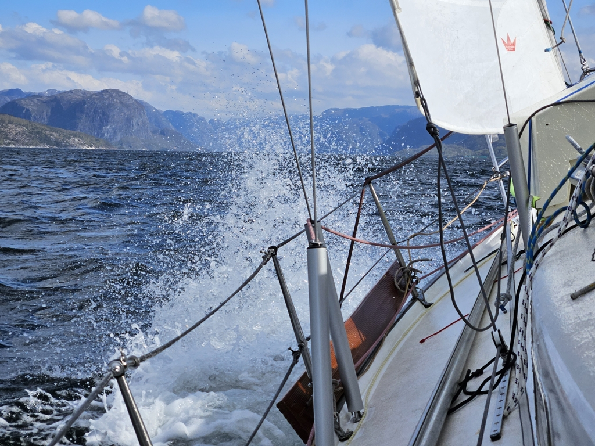
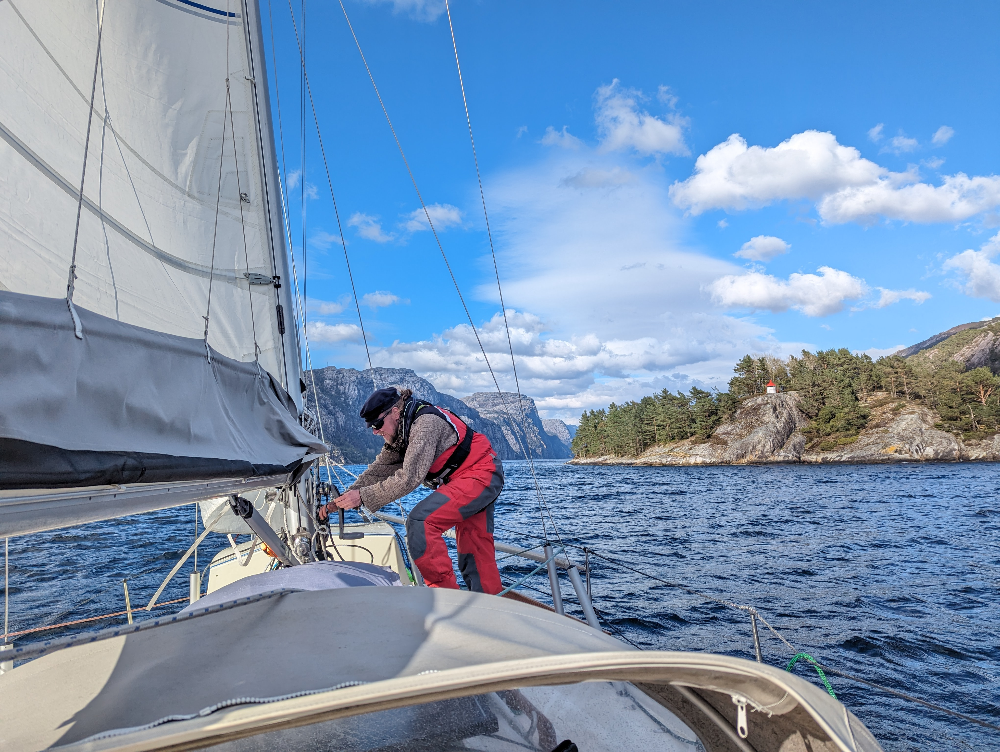
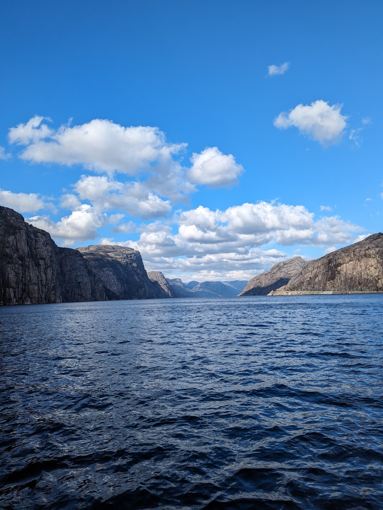

After doing the laundry it was time to head out for the day. The aim was to beat our way to Lysefjord for some epic anchoring scenery. We left the harbour under gusty conditions and raised the main in first reef under the wind shadow of some tall apartment buildings. Staysail followed shortly after. 

 

From between the hills the wind was gusting up to 30kn, so we reduced our main to second reef before entering the long Høgsfjord where the wind and waves had a 10 NM fetch. So the tacking started. Boat was behaving well and we had so much fun with the water splashing over the bow. We shared our water today with multiple fast sightseeing RIBs and bigger sightseeing catamarans, all doing well over 20 knots. 

 

After the whole day of beating it was nice to turn into the Lysefjord and downwind sail it. The scenery is gorgeous and one has hard time understanding the scale of all of it.

 

* Distance today: 18.8 NM
* Total distance: 799.6 NM
* Lunch today: Feta salad
* Engine hours: 0.7
