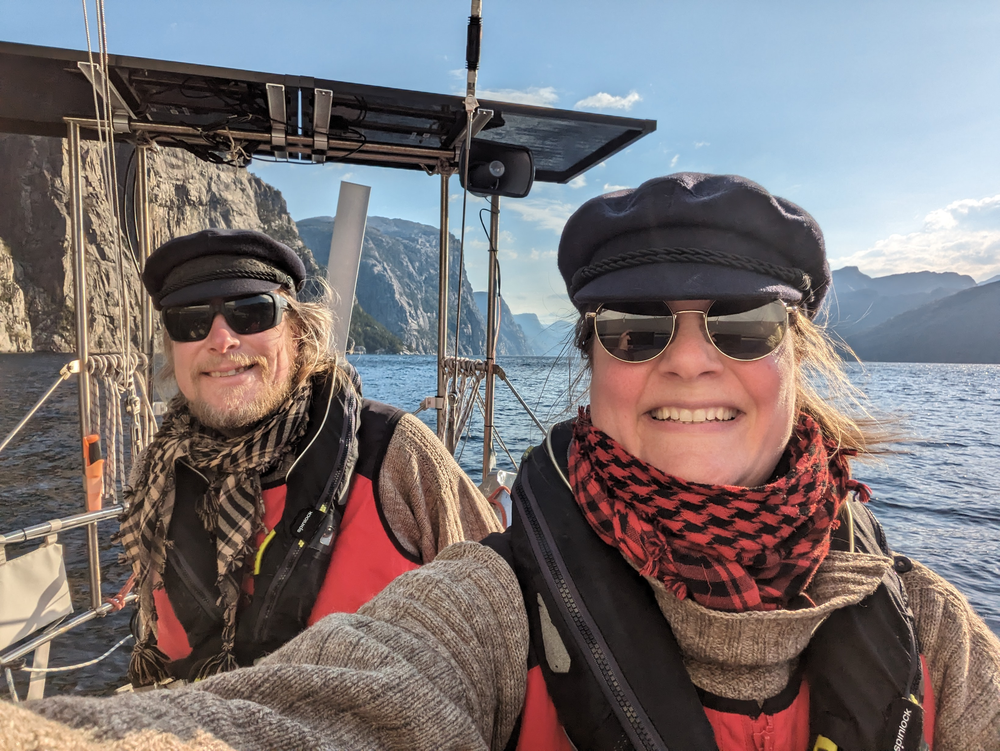
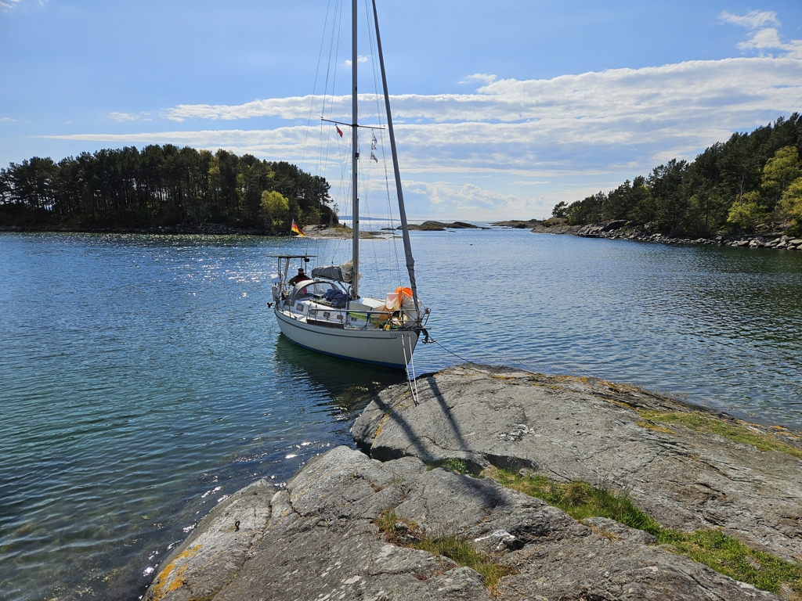

Fjord weather can be quite unpredictable, and today was a good example of that. A wind shift by 20° in the forecast meant a complete 180° on Lysefjord, and suddenly all of our anchoraging bay was a lee shore. Thankfully holding was good, but there was a short steep chop that made the night quite restless.

 

After the morning coffee we hoisted the anchor from 10m deep, and set sail. In the fjord we had winds mostly above 20kt, and halfway out of Lysefjord there was a second 180° shift that meant we had to tack our way out past the majestic cliffs. Then it started raining.

But what a difference when we got out of the fjords! Wind became lighter and the sun came out. We shook the reefs and proceeded north in nearly perfect sailing conditions - wind around 15kt from the starboard quarter, no sea state, little traffic, and snowcapped mountains everywhere you could see!

 

For Vappu we decided on a nature harbour that had been recommended by many local sailors: Lagunen is a 17th century marble quarry island with multiple protected bays with crystal clear water and sandy bottoms. Above the surface it looks like the Finnish archipelago, and below like Bahamas!

* Distance today: 31NM
* Total distance: 830.6NM
* Lunch: toasted rye bread with cheese
* Engine hours: 1.2
