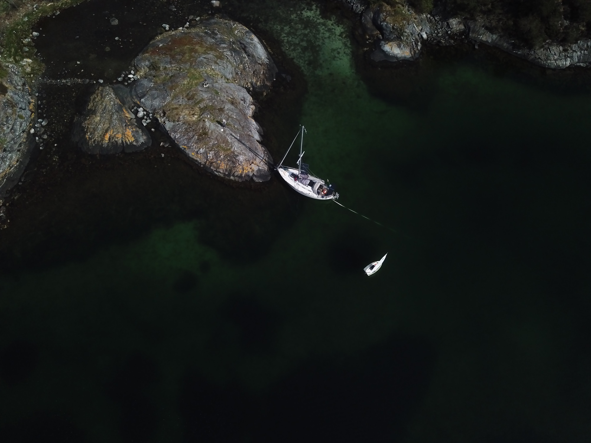
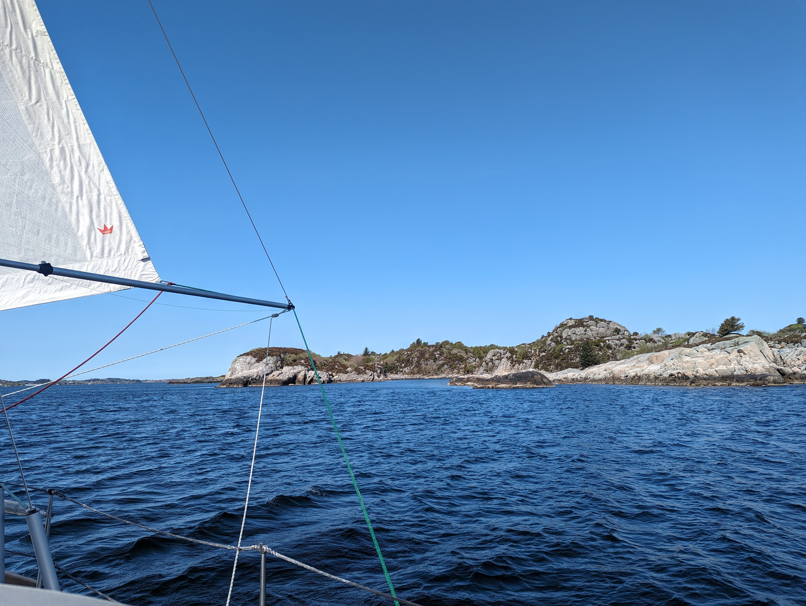
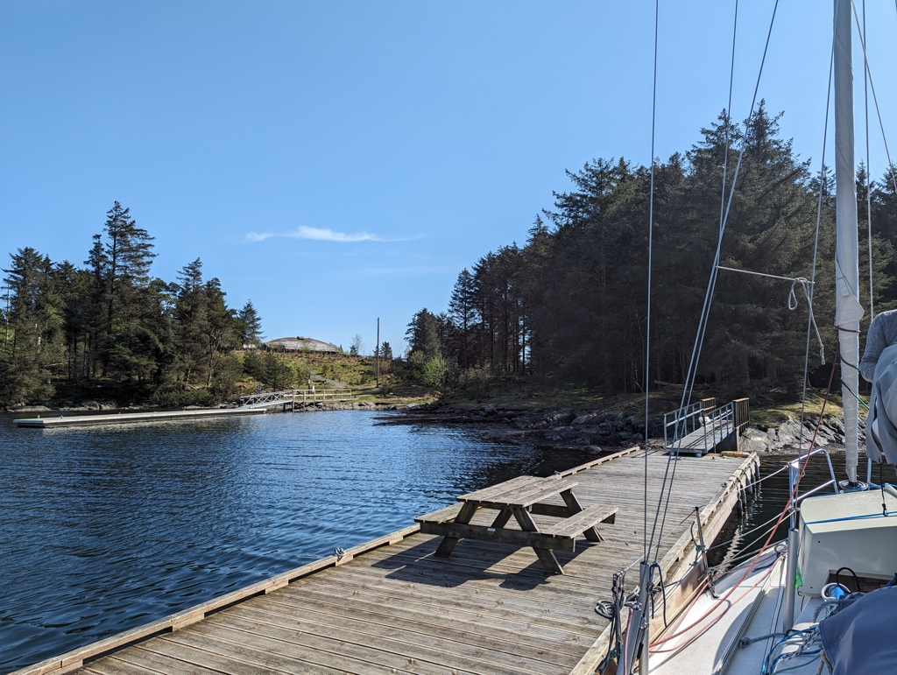

 

After a lovely 1st of May sailing Isosaari in the picture perfect Lagunen, it was time to head towards Bukkøya and it's Viking settlement center. The route would take us through parts of the "Nordvegen", the northern route that this country is named after. This protected way north has been in use since at least the viking age. 

The Boknafjord was turbulent as the wind, gusting up to 29 knots has a fetch of over 40 NM, so the waves were big and we were heading dead downwind tilting from side to side like a pendulum. Not the most comfortable section of the day. As soon as we got to the shelter of the islands it was a completely different story. The islands here are covered with plant life as it seems the waters are always calm and not even the most horrendous storms have enough room to whip up big waves.

 

The Karmsund is not the most picturesque of sounds, but it is nice to sail a route that has been in active use and an important trade route for more than thousand years. We feel a connection to the rich past of sailing in these waters.

Tomorrow we'll spend the day exploring the Viking settlement center. We're currently comfortably tied to their visitor pier.

 

* Distance today: 21.7NM
* Total distance: 852.3NM
* Lunch: avocado pasta
* Engine hours: 0.5
