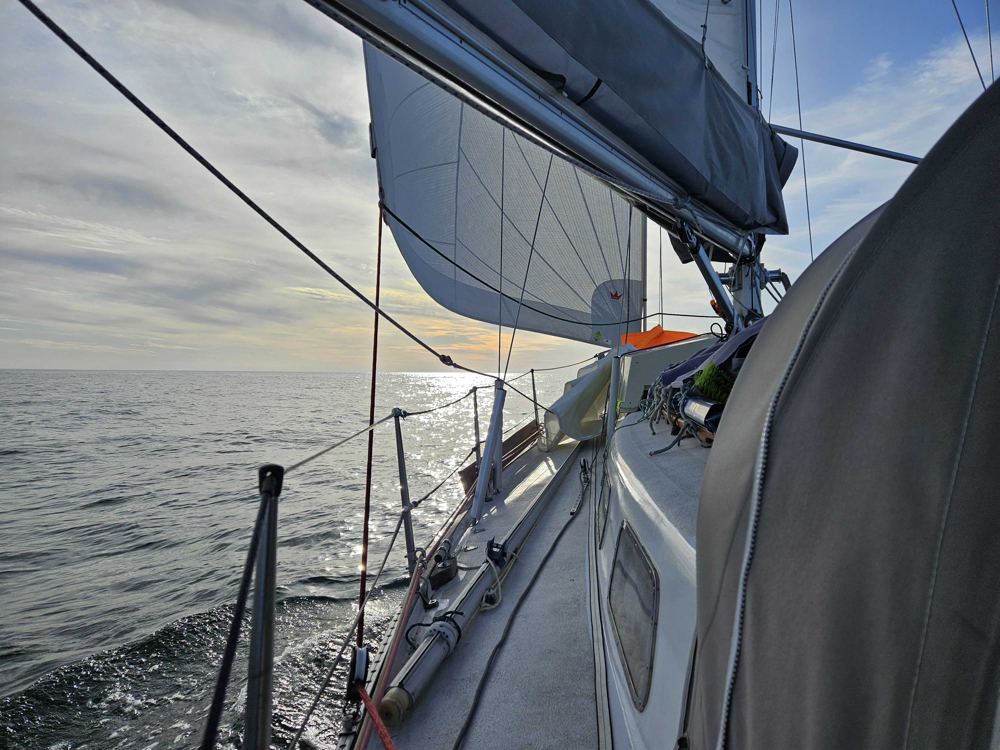

In the morning we visited the Nordvegen Historical Center. What a cool experience built inside the hill! Especially when you have the museum all for yourselves.

Returning to the boat, the forecast was still looking favourable. So we filed the British Pleasure Craft Report (turns out the system doesn't work with scandic characters in boat names), sewed together a courtesy flag, and made the boat ready for the sea.

We passed the Karmsund tidal gate with a favourable 1.5kt current, and gave the Viking kings of old there a shot of some excellent Danish mead for good fortune.

After passing the island of Røvær, we were once again on the open sea. Very light wind, but combined with a small mellow northerly swell it makes for slow but comfortable sailing. Now we sail towards the sunset as we get again settled in out watch schedule.

 

* Distance today: 24.2NM
* Total distance: 876.5NM
* Lunch: chanterelle risotto
* Engine hours: 0.6
