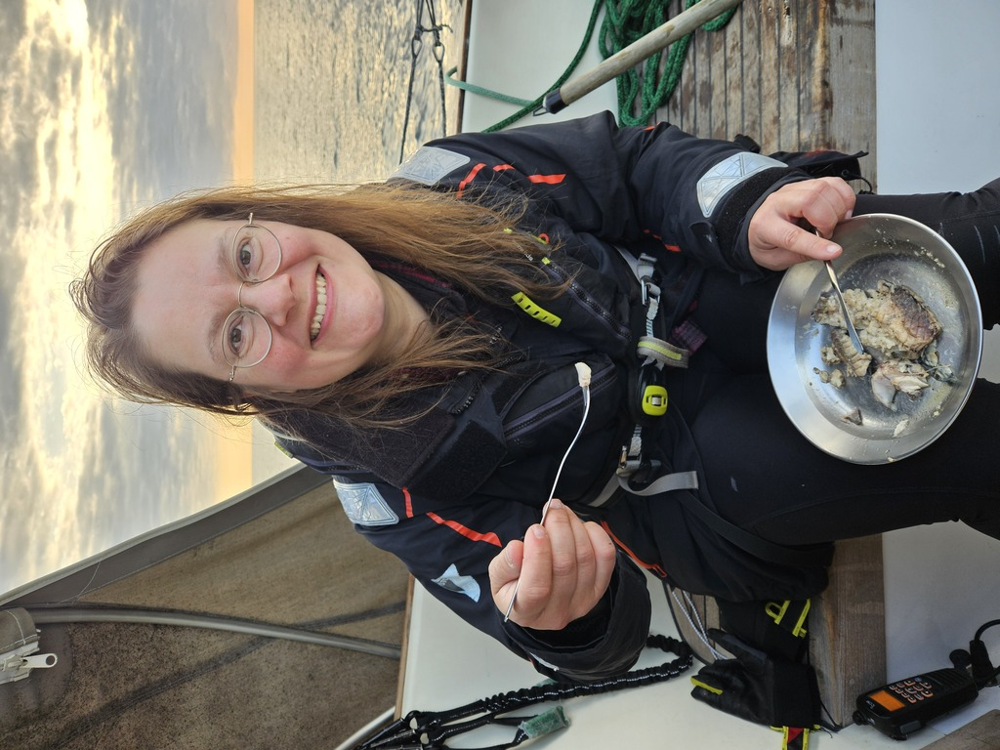

The first watches were accompanied with only a slight breeze and we were gliding towards west slowly. As the darkness fell, we were going wing on wing with the occasional bigger wave throwing us off course easily. As the second watch change came, we decided to give up the wing in wing and change our course for a higher broad reach. That would give us diminished sail flapping so better sleep for the off-watch.

 

That sleep was broken up in the morning with a frantic "We have a fish!" By the time Suski was out of bed, Bergie has pulled the mackerel on deck and dispatched it. Now came the conundrum, neither of us had cleaned and filleted a fish in over 20 years! So we pulled up from the boats digital library instructions of how to do this. Suski was reading and showing pictures to Bergie and he followed the instructions successfully. Breakfast became fried mackerel in olive oil and garlic. Fish this fresh is very tasty.

 

Now we are going through a series of fog clouds with our navigational lights on and sounding the fog horn. Halfway mark has been passed and we are making good progress.

 

* Distance today: 102 NM
* Total distance: 978.5 NM
* Lunch today: Avocado wraps
* Engine hours: 0
