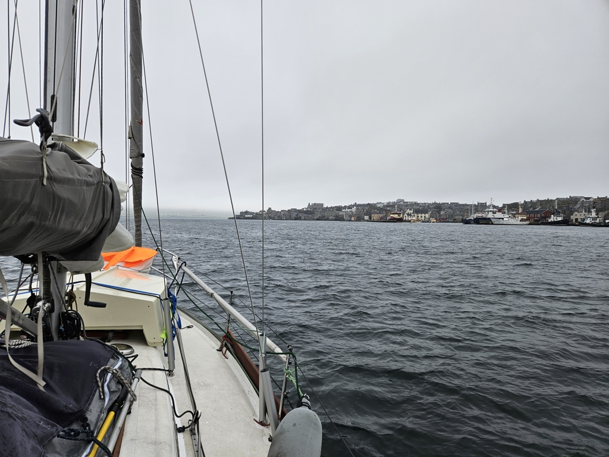

As we went into night watches the fog kept getting thicker. The wind also picked up, and built a sea state of about 1.5m. Finally the North Sea looked more like we expected it to look!

We rolled half of the genoa in, kept the automatic fog horn blasting, and continued our way. A certain milestone was reached around 3am, as we crossed the Greenwich meridian to the Western hemisphere. Soon we could start hearing the announcements from Shetland Coast Guard on VHF.

 

When we could finally see land (not from very far due to the fog), we called the Lerwick Port Control on the VHF and were permitted to proceed to the small boat harbour. Since we were arriving in the morning, the piers were full. We ended up rafting with a German aluminium boat, the only other visiting yacht at least slightly on the same scale as Lille Ø.

 

We celebrated the passage with a full English breakfast. Next will be paying the harbour dues, and then likely a nap.

* Distance today: 85NM
* Total distance: 1063.5NM
* Lunch: full English breakfast 
* Engine hours: 0.6
