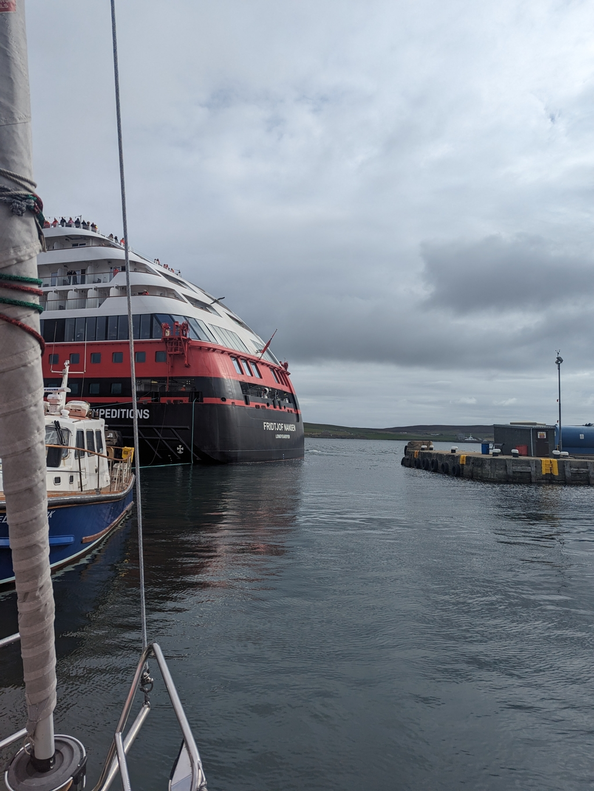

We left after getting a clearance from Port control. The motoring out was was a bit more existing than coming in, as the aft end of "Fridtjof Nansen" was blocking 2/3 of the harbour entrance. After clearing the Hurtigruten cruiseliner, we hoisted our sails and settled for the broad reach course of today.

 

Fairly soon we were out of the protection of the islands and we were greeted byt the gentle ocean swell once again. The fog of two days had turned into a grey morning which turned into a sunny afternoon. Finally we could properly see where we had sailed to!

 

Now we are anchored in a small bay next to the airport, but only a kilometer away on the island awaits our excursion of the day, Jarlshof archeological site featuring housing from the Bronze ages onwards.

 

* Distance today: 18.4NM
* Total distance: 1081.9NM
* Lunch: feta salad
* Engine hours: 0.5
