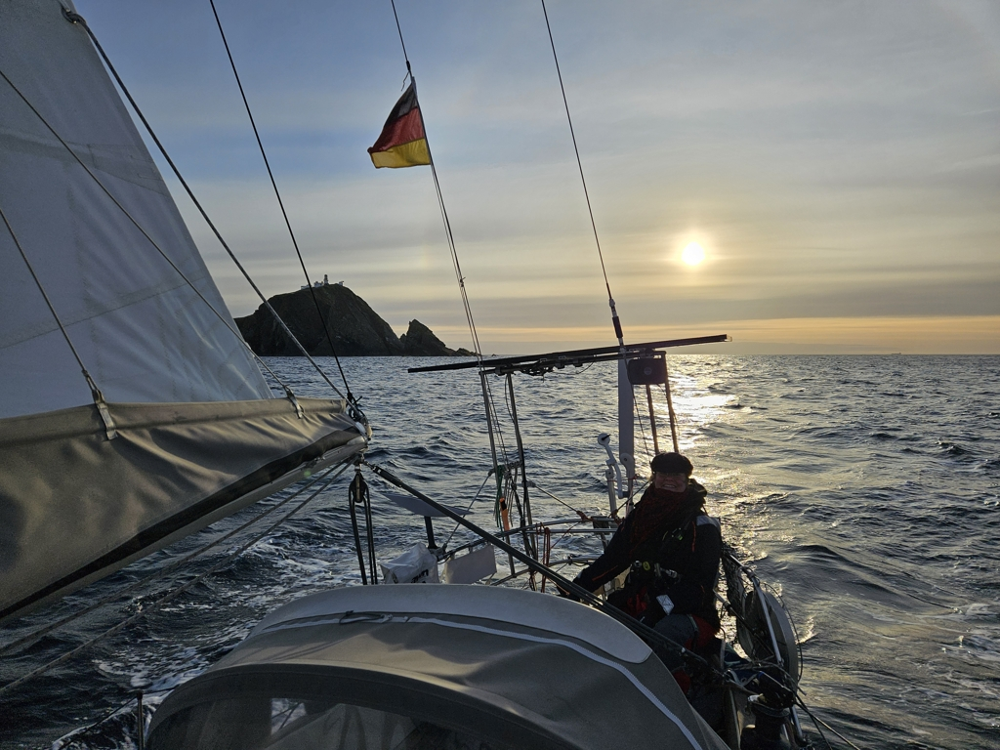
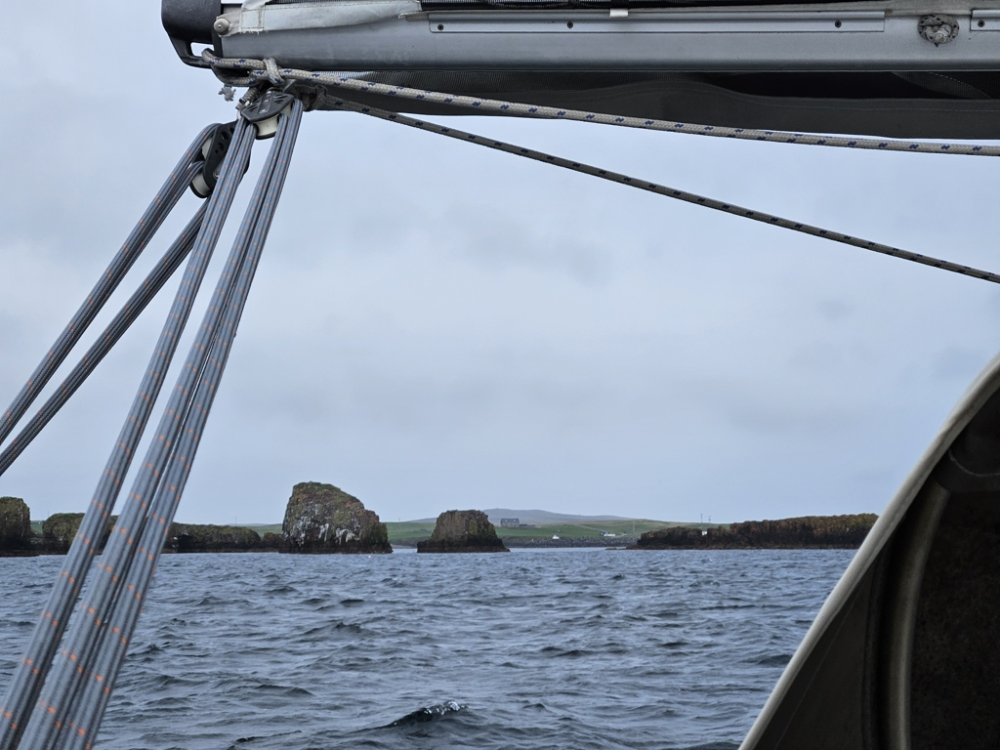

Today's puzzle was getting past the tidal race at Sumburgh Head. While visiting the excellent Jarlshof site, we could see some pretty nasty overfalls out there, as wind was against tide. So, time to consult the tidal stream charts.

As a result, alarm was set at 4:30, and we left the anchorage again at sunrise. This meant that we went by the race at slack tide, but also sadly meant that we had a current against us most of the rest of the day.

 

But again a lovely downwind sail. Despite this being the side of Shetland that is exposed to the full Atlantic Ocean, we surfed down quite easy rolling waves. After rounding Sumburgh Head, we let the windvane steer, and for over five hours didn't have to touch a line.

 

Now we're anchored in the Housa Voe bay on the island of Papa Stour. The rest of today should have quite miserable weather, but we look forward to exploring the island more tomorrow. There should be plenty of birds and some epic cliffs to see.

* Distance today: 39.7NM
* Total distance: 1121.6NM
* Lunch: spaghetti with avocado sauce
* Engine hours: 1.2
