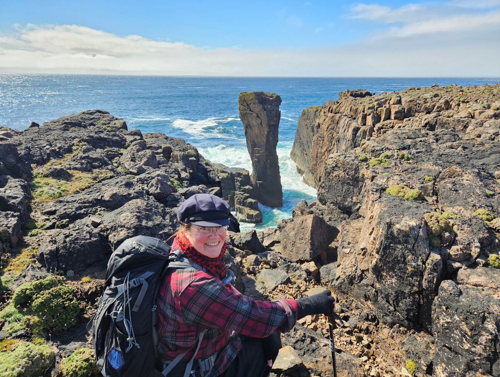
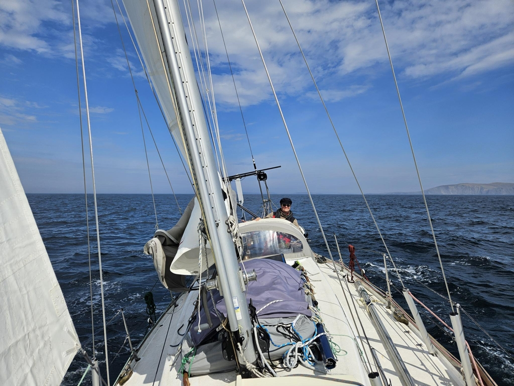
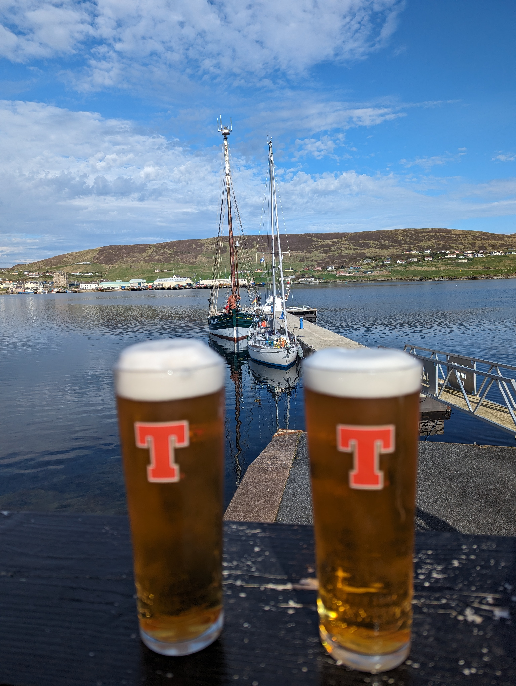

Papa Stour offered some amazing hiking among the steep cliffs and Lapland-like fells of the interior. But now there's some weather coming and hence time to move to a more sheltered position.

 

We waited for the slack tide and headed out. In the narrow pass just south of the island we were greeted with a 4kn current and substantial standing waves. So it seemed our timing was wrong. We had observed on our walks the calmer areas, so we motored through there.

 

When we were done with the pass, we hoisted our sails, first reef and staysail. Then it became genoa and unreefed main. Then motoring. Then sailing. Then motoring until we reached the small archipelago in front of Scalloway. Then it was an amazing beam reach through the skerries between islands. 

We found the Scalloway boat club floating pontoon without issues. We made a perfect docking manouver and tied us in. And then we had a speeding fishing boat come through making a huge wake. And we immediately decided to move to the more sheltered side of the pier. So we took off, drove a circle to give us time to retie all fenders and retied Lille Ø on the other side. 2 manoeuvres means 2 anlegers! Thanks Bernhard and Karsten!

 

* Distance today: 26.4NM
* Total distance: 1148NM
* Lunch today: Avocado salad
* Engine hours: 2.3
