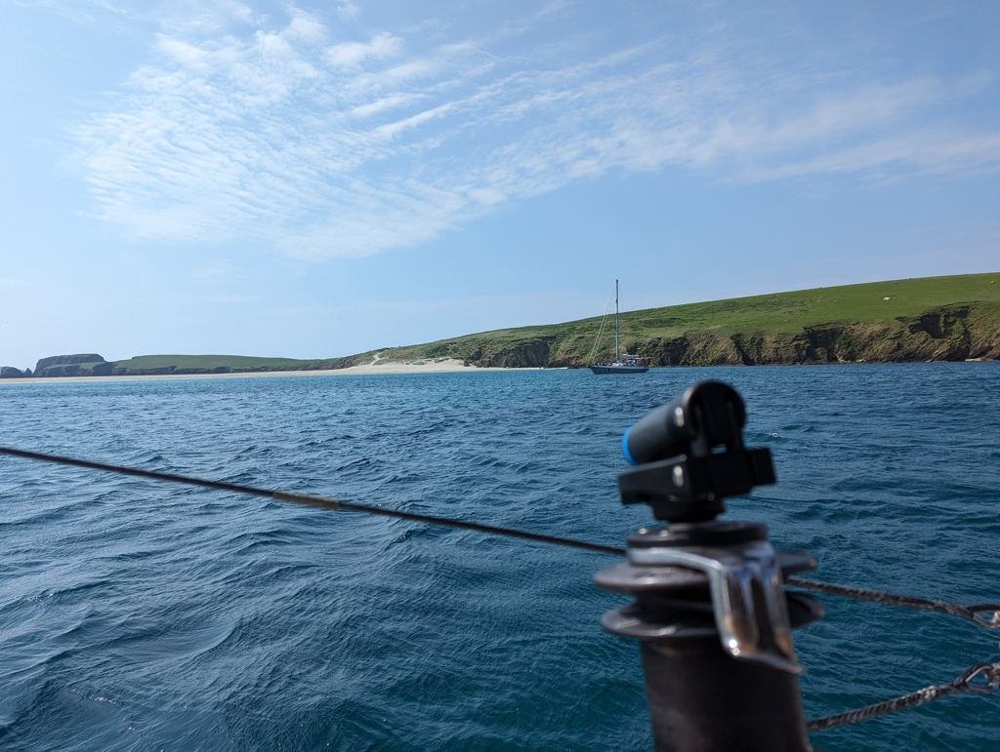

Two days with heavy winds in Scalloway went by quickly. We visited the local museum, did some small provisioning, and a lot of laundry.

Then today the wind finally seemed a bit more reasonable F5, and we decided to sail on. As the protected side of the visitor pier was a bit of a tight spot, we first moved the boat to a better starting position with lines. Then under way at slack tide, and sails up in the fairway.

 

Winds have been blowing from the same direction for a week now, and so there was quite a lumpy sea state while tacking offshore. The waves were cutting the boat speed to nearly nothing, not aided by the small tidal current against us.

As soon as it was feasible, we tacked into the route protected by some small islands, and going became a lot more comfortable. And of course the majestic cliffs and rolling green fells on the shore were something to enjoy!

 

Now we're anchored at the tombolo connecting St. Ninian's Isle to mainland Shetland. A really picturesque place that we hope to explore when the winds quiet enough in the coming days for landing the dinghy. We share the anchorage with _Born to live_, the German sailboat we met already in Lerwick.

* Distance today: 15.8NM
* Total distance: 1163.8NM
* Lunch: Couscous salad
* Engine hours: 0.8
