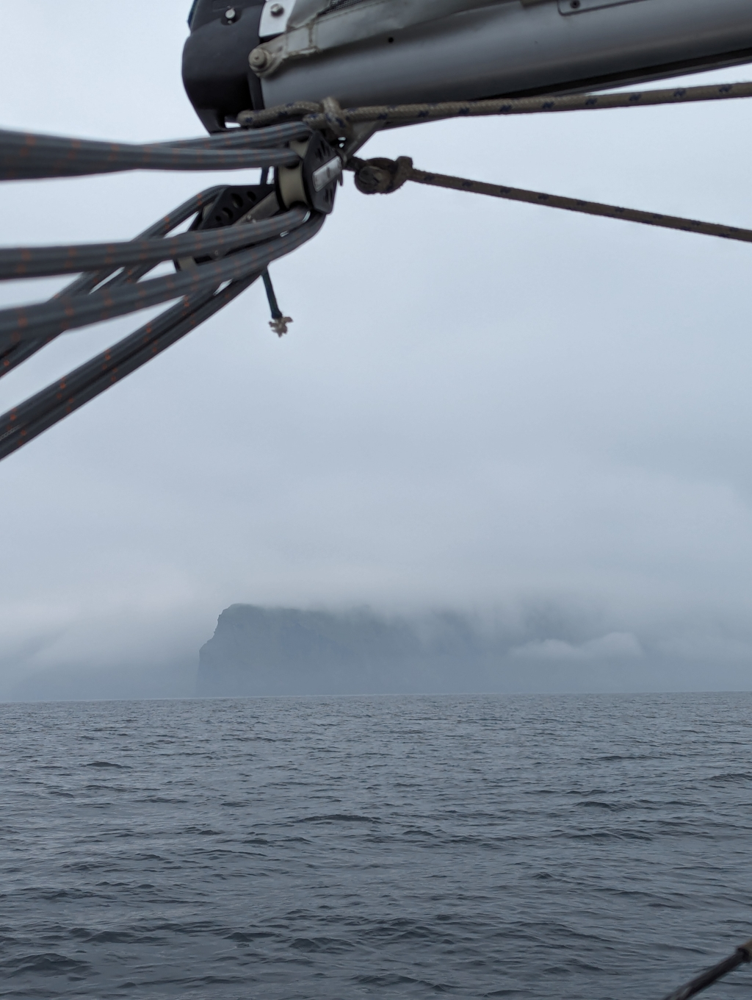
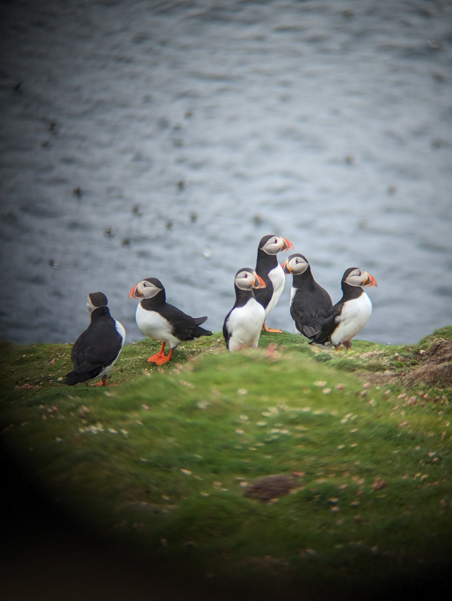

The alarm rang at 5:30 so we could catch the tidal current going south. We motored the first half of an hour before the wind filled in and we could start sailing. We had been waiting for suitable weather to sail south already a couple of days. Lovely island time and dinghy adventures on St. Ninian's. Sailing in these waters is not a game for someone with a schedule.

 

We had a lovely beam reach for the whole way. Climbing up and down on the gentle slopes of the Atlantic swell. The visibility got better as the day progressed and we got sight of Fair Isle already 10 miles out! A good result here.

As we arrived to the harbour we were greeted with fleet of puffins flying. After rounding the massive wave break we went in second row tied to our friends _Born to Live_ who arrived jusr few minutes earlier. Now it is time to prepare the outdoor boots and go see more puffins!

 

* Distance today: 29.1NM
* Total distance: 1192.9
* Lunch: lentil curry and rice
* Engine hours:
