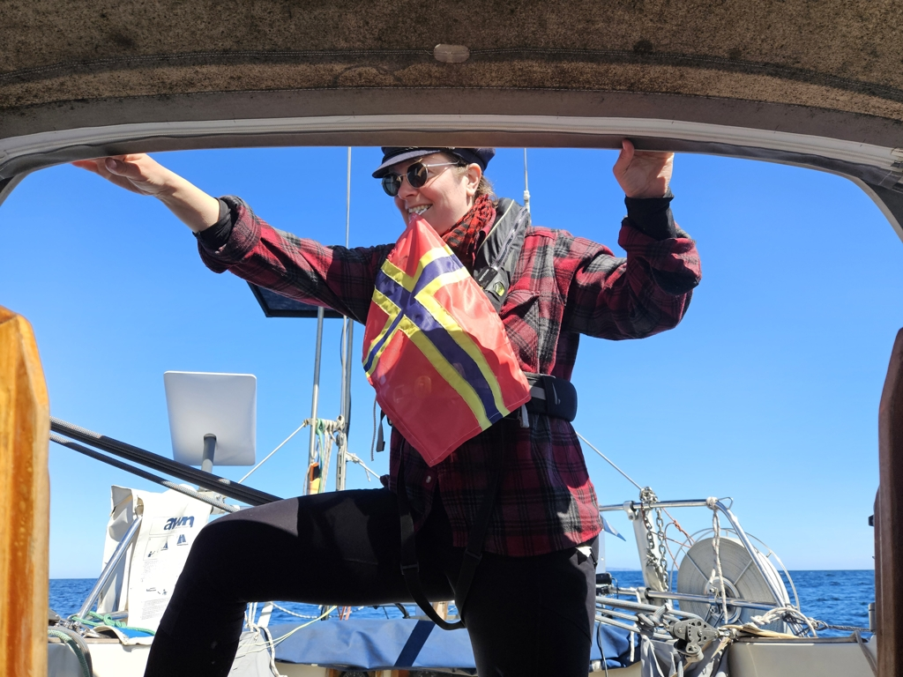

Fair Isle proved to be worthy of its reputation. Amazing landscapes, tons of birds, beautiful lighthouses, cozy little museum, and even remains of a crashed WWII bomber just lying on a field.

While we were there, the harbour was quite busy. The season seems to have started! We ended up sandwiched in a raft between two big aluminium boats.
So to extricate ourselves this morning, we waited until crews of both boats were up and caffeineted. Then we released our boat, backed out of the raft, and let the two boats retie their lines. Then out to the open sea!

 

The Atlantic was today on a gentle mood. We had a picture perfect crossing to the Orkneys in full sunshine an a broad reach, with almost no swell.
The waters here are quite empty, we only saw one freighter heading the other way.

 

As the Orkney Islands have a new flag of their own, Suski made one while we were under way. A happy merging between a Q flag and a spare Norwegian courtesy flag!

 

Now we are anchored in the wide Fersness Bay off the island of Eday. From here we can start exploring the Orkney Islands. In this area, the tidal currents are the king, so our schedules will be heavily dictated by those. And a full moon is coming. 

* Distance today: 47.2NM
* Total distance: 1240.1NM
* Lunch: spaghetti bolognese 
* Engine hours: 1.3
