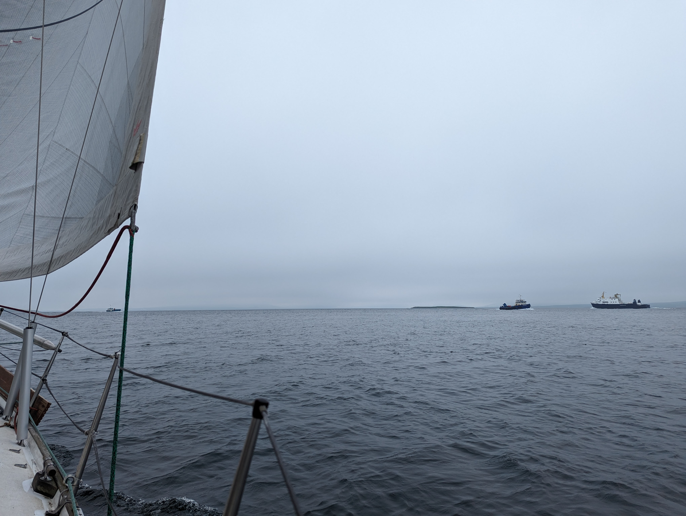

After consulting the Reeds Nautical Almanac, the departure time was set to 8am. We needed to arrive around 10:10 to get the slack tide when catching the mooring buoy from Orkney Sailing Club.

We woke up to a grey, foggy morning and prepared the boat for the short hop. As the anchorage had plenty of space, we decided to sail off from anchor. We hoisted the main sail and got the anchor off without issues. Then it was off to the races. At best we had 9.4 kn of speed over ground! It is magic what a 3.5 kn current does to your boat speed.

 

As we approached our destination we had a bit of traffic as Kirkwall is just across the sound. We arrived at the buoys right in schedule and caught the slime line without issues. First time staying in this kind of a mooring buoy. Now it is time for a big brunch!

* Distance today: 13.9 NM
* Total distance: 1254 NM
* Brunch today: duck egg omelette
* Engine hours: 0.2
