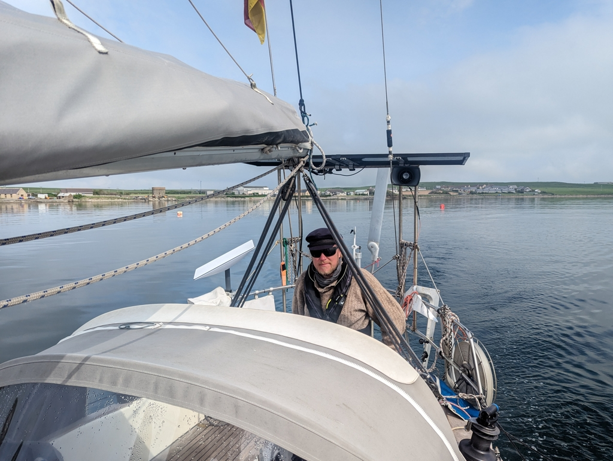

A gloomy morning. Windstill and thick fog where even the nearby shore disappeared occasionally. We could hear the fog horns of Kirkwall ferries, and weird howls from what must've been the seals living in the bay.

 

To do the short hop over to Kirkwall Marina, we had to balance three factors: the fog, the up to 2.6kt current, and the forecasted heavy rain. In the end we decided to kind of split everything in the middle, leaving at 11am with a slightly lifted fog, and a smaller countercurrent. 

 

No wind meant motoring across. As we untied the Orkney Sailing Club visitor buoy,  a seal swam over to check us out. Under way we got to dodge one ferry and one sailboat going the other way before tucking ourselves securely behind the thick wavebreaks of Kirkwall harbour.

Now we'll spend a couple of rainy days here, charging batteries, provisioning, and visiting the local neolithic sites. 

* Distance today: 3.5NM
* Lunch: burgers and beer
