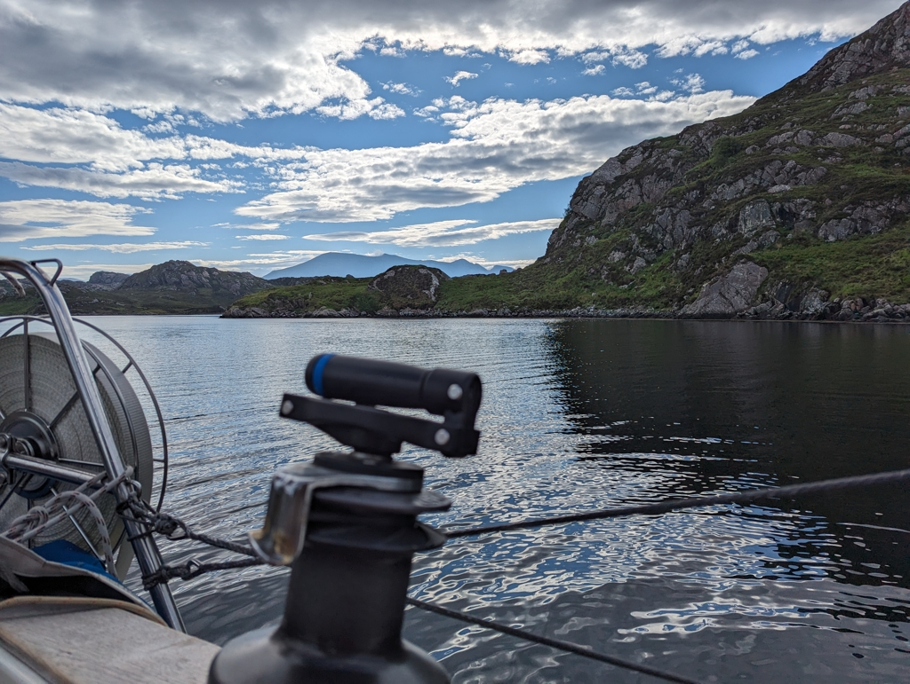

12:30 at high tide, we cast our shore lines and motored out of the wave break. After it we hoisted the main in 1st reef and the staysail. We were heading south towards Cape Wrath! For this passage to be on our list there were few requirements. Get both leaving Orkneys and arriving at Cape Wrath with tide with us wind accompanying. So when the easterlies came, we jumped at the chance ditching our plan to take the easy route via Caledonian Canal. Rounding Scotland from the north it was.

 

Exiting Eynhallow Sound we were greeted with few standing waves. Lille Ø lurched over them with a couple of big splashes, pushed by the 6kn current, and we were off to the Atlantic swell once more. Getting our windvane to stay on course required a bit of tuning as the wind kept switching between 20 and 30 knots. We were flying towards our time slot from 1am to 7am of passing Cape Wrath with good speed. 

 

As we came closer the wind reduced first from 30kn to 24kn, then to 20kn and 15kn. Finally at 4am together with the rising sun we passed the Cape nearly in flat calm. The tide pushed us along until the wind died completely. Then started the game of cat and mouse with the wind. No wind, motor on. Wind comes back some 20 minutes later. Motor off, sails up. A bit of sailing until again no wind. So a standard Havel Experience. One might have had the patience with a well rested night behind, but neither of us got much sleep on our off watches as we were barreling through waves and it gets a bit of getting used to every time.

We are now tucked in to our anchorage in a picture perfect Loch. What a great start for this chapter in our sailing adventure.

 

* Distance today: 101NM
* Total distance: 1358.5NM
* Lunch: cheese and vegetable wraps with potato salad 
* Engine hours: 2.1
