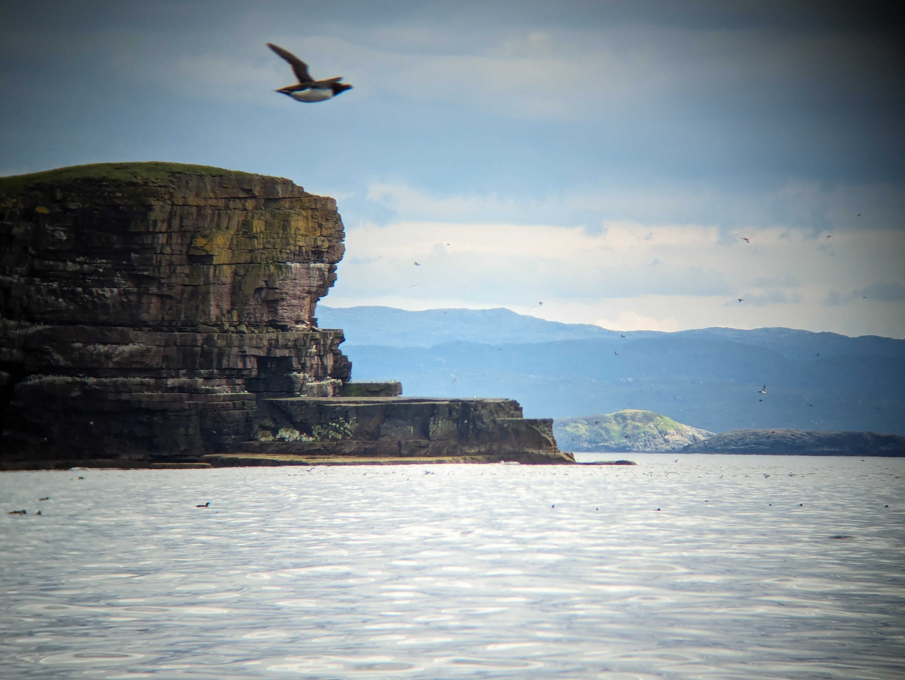
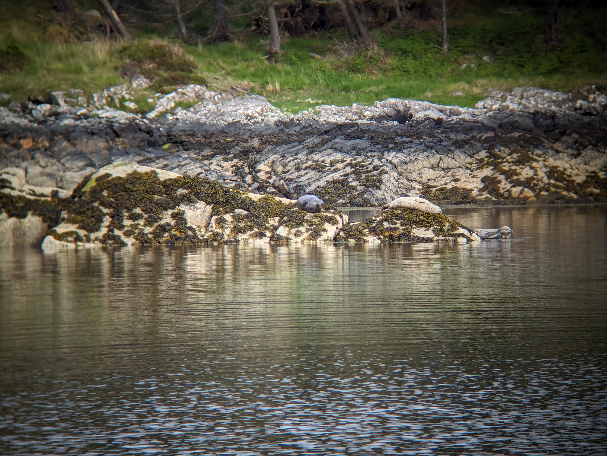

Playing the game of when to leave and when to arrive gave us the times of 12 and 18. We hoisted the anchor and main sail in quick succession and turned to a downwind exit from our anchorage. From there we retraced our way back out and got to experience some good old Havel-style winds. It seems here you check from the forecast the wind strength, not the direction.

Our route took us past the Handa Island, a bird sanctuary. We saw thousands of nesting guillemots and fulmars. As we were passing Handa we heard a dolphin or a whale and Suski saw a dark back with a thin long fin disappeared back into the sea! What an exciting moment!

We had wind practically from all quarters at some point, so sailing was also interesting. As we approached Loch Shark the frequency of lobster pots grew higher and both of us were checking out for marker buoys, some easier to spot than others.

The entrance to Loch Shark is narrow and shallow, so entering at rising tide was required. Then at least you have a short time to wait if you run aground. Suski was in the bow spotting the route and in one occasion it was necessary to call directions to Bergie steering to avoid hanging high and dry for a moment. We made it in at very slow pass without getting stuck, success!

As we were dropping the anchor, Bergie first spotted a sea eagle and then a bunch of seals sunbathing. What a place! Dinner with scenery and entertainment is set!

* Distance today: 17.5NM
* Total distance: 1376NM
* Dinner: rajma masala
* Engine hours: 0.8
