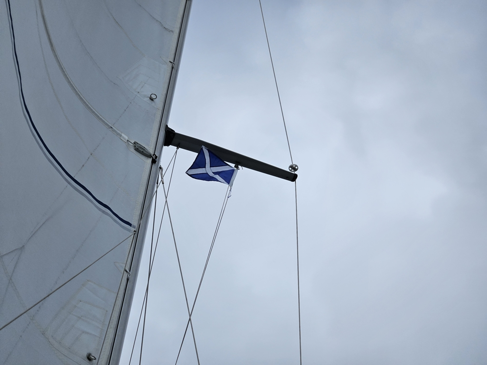
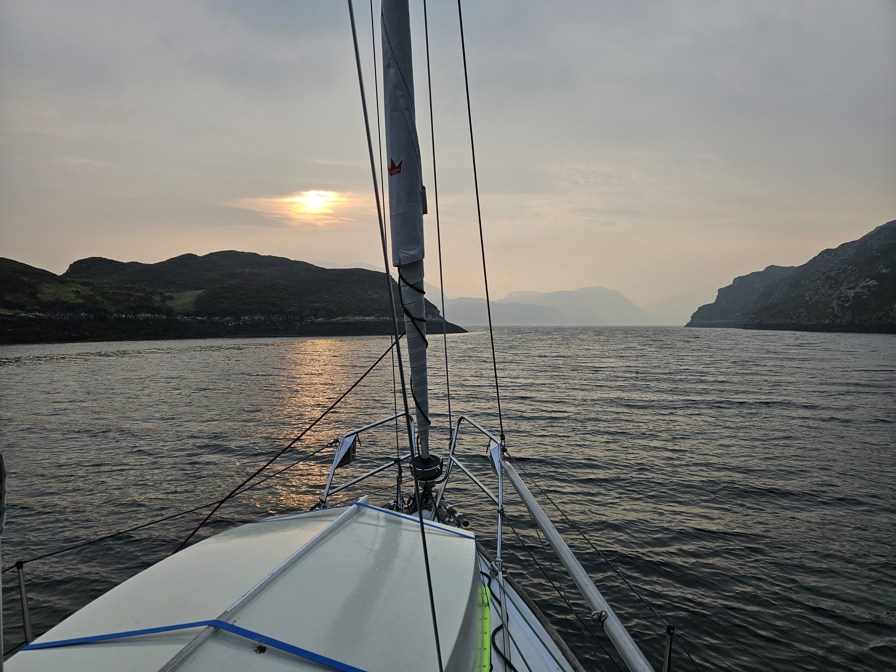

We spent a nice day in the beautiful Loch Shark, doing some boat projects and generally enjoying the time. But today there was again wind in the forecast, and from the right direction. So time to sail!

We hoisted the anchor and navigated carefully across the narrow bay entrance on a rising tide. The British yacht that had shared the anchorage with us was right on our heels, watching our every turn.

 

The day was spent on a glorious broad reach towards the Outer Hebrides. The wind varied quite a bit in strength so we got to experience both ghosting along at 5kt of wind, and reefing at 27kt.

 

Now we're anchored off Eilean Thinngarstaigh on one of the fjords of the east side of Harris. Absolutely stunning anchorage with sun brightening the misty fjord, and a waterfall splashing on the hill next to us.

* Distance today: 56.9NM
* Total distance: 1432.9NM
* Lunch: scrambled eggs with fried potatoes and kidney bean patties 
* Engine hours: 1.1
