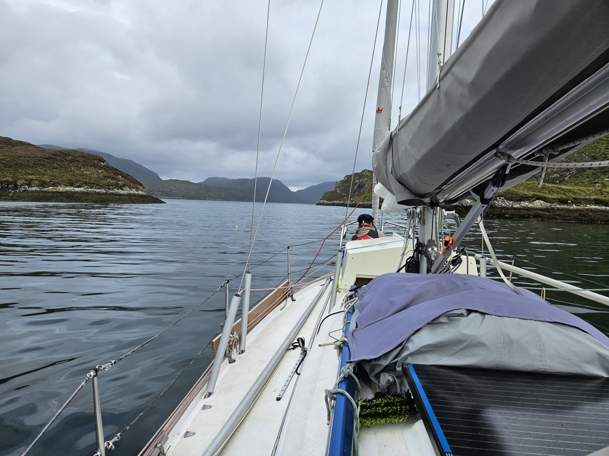

We enjoyed our morning coffee outside, watching the seals hang out on their rocks "sunbathing", though the sun was just a faint promise behind the clouds. We hoisted the anchor and the mainsail and rounded the island to head downwind out of the Loch Claidh. After turning to our course we rolled out the genoa too. In the cover of the island we had flat calm waters and oh what a joy it was to sail. Until the next Loch and a dead headwind to an outgoing flow on rising tide?!? So we switched to the iron gennaker and slowly made progress towards the Tarbert marina in a drizzle.

 

We called in ahead and were assigned the outmost finger pier. With the full keel it is always nice to be in a place where it is easy to manoeuvre in and out from. For anlegers we visited the Harris Distillery and got G&Ts as recommended by one of our Gothia colleagues. At this point the sun came out, and so  we ate at the hotel overlooking their gardens, and did a tour of the small cozy village.

 

Cheers to Andreas M!

* Distance today: 9NM
* Total distance:
* Lunch: fish sandwiches and caesar salad
* Engine hours: 1.9
