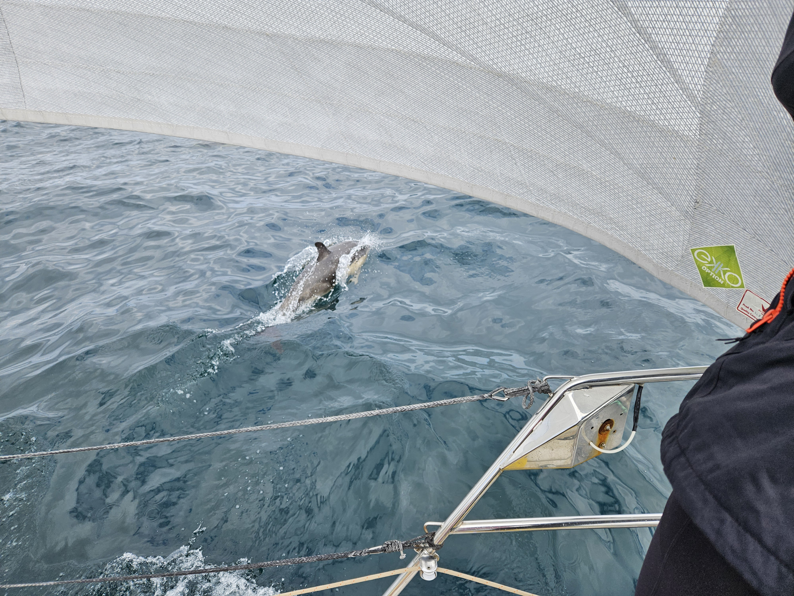
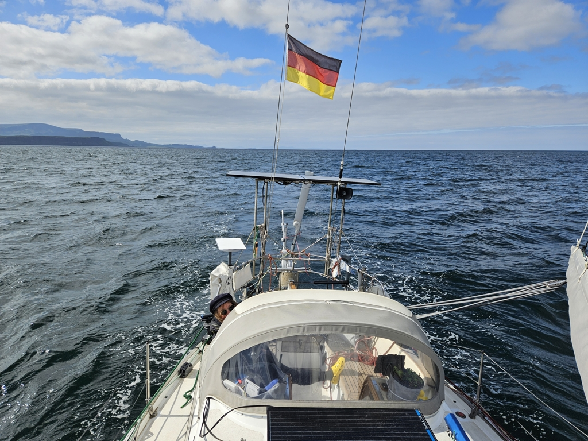
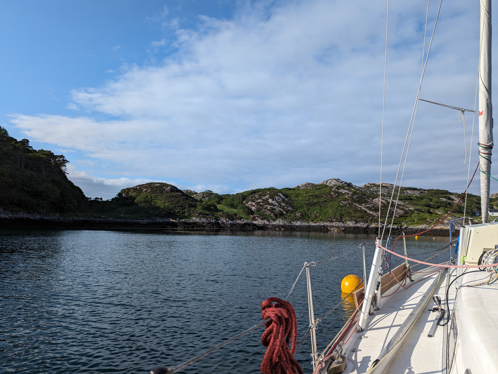

We started the day with excellent cappuccino from the Tarbert pier's coffee truck. Then boat ready, and out of the harbour before the Calmac ferry would block the exit.

Our initial plan was to just sail the three miles to the nearby Ob Lickisto anchorage. But after checking it out with a sail-by, we deemed the conditions on The Minch to be too excellent to pass. And so we turned the bow towards the Isle of Skye.

The change in plans was quickly rewarded, as on passing the Eilean Glas lighthouse, a minke whale surfaced next to the boat. A real whale, right next to us!

 

Not to be outdone, the next visit was by a pod of dolphins. First only one came to check us out. Then half hour later, a group of five that played for a good while in our bow wave. Wow!

Sailing conditions were again lovely. Sunshine, broad reach with force 4. Some current, mostly from the side, and no waves to speak of. And the jagged peaks and green hills of Skye framing it all.

 

We picked a visitors' mooring at the pretty bay of Acairseid Mhor on the island of Rona. This was reputedly a medieval pirates hangout, and we look forward to exploring the island tomorrow. 

 

But now some sparkling for the beginning of June, and hence, summer! Kippis, Martina!

* Distance today: 37.1NM
* Total distance: 1479NM
* Lunch: feta salad
* Engine hours: 0.4
