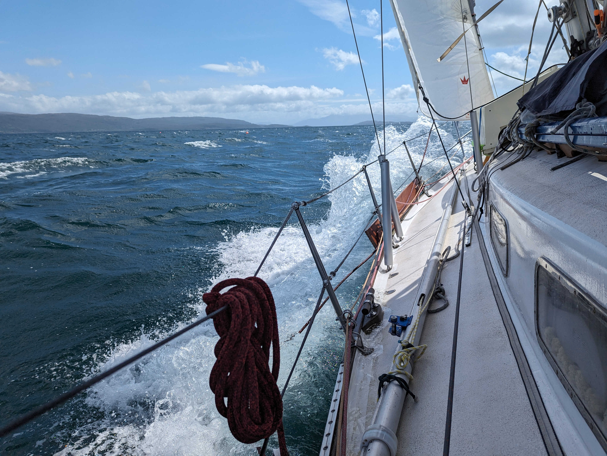
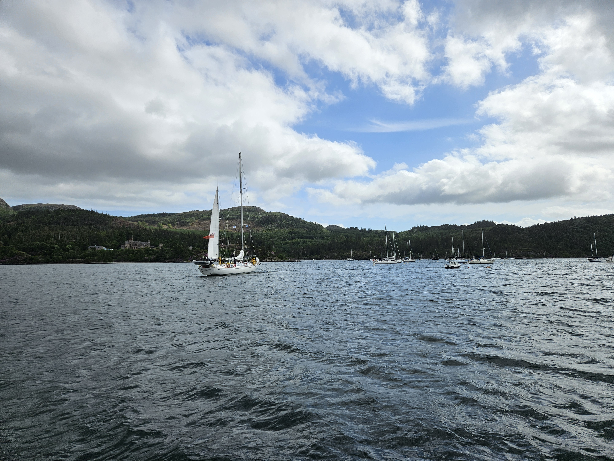

You know something is up when the locals start moving their boats to more secured locations. After two nights in the picture perfect bay head out. We released the slime line from the mooring ball and motored out. Wind dead on the nose we weaved through the rocks and shallows onto ever increasing swell. Instead of just carefully navigating with slow speeds we powered through with decisive speed. At the last narrow we were on our standard cruising revs on the engine but doing only half of the standard speed. As soon as the shallows were behind us we hoisted the main in 1st reef and our staysail. And then we were off with 30kn of wind on the beam! 

 

We dodged lobster pots whilst screaming along at hull speed. The hydrogenerator was happily churning angry pixies to our batteries as the few overcast days had made a dent in to the charge level.

As we approached Plockton, we were surprised by a Royal Air Force Harrier coming at us at very low altitude. Its not everyday when you get close encounters with those! And maybe better so for the dear eardrums. As we rounded the light house we were greeted with a sight of a bay full of moored and anchored sailboats. We had been wondering where everybody is but now we had our answer.

 

We'll stay here waiting out the forecasted thunderstorm and venture out when the wind is back to more reasonable levels.

* Distance today: 19.7NM
* Total distance: 1498.7NM
* Lunch today:
* Engine hours: 0.7
