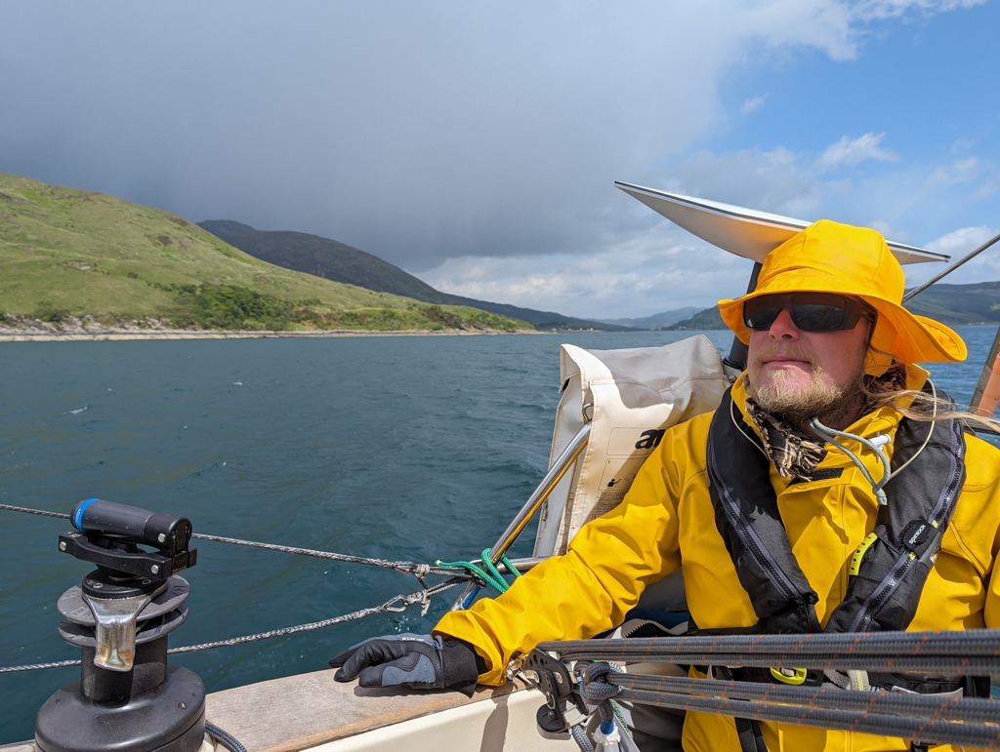
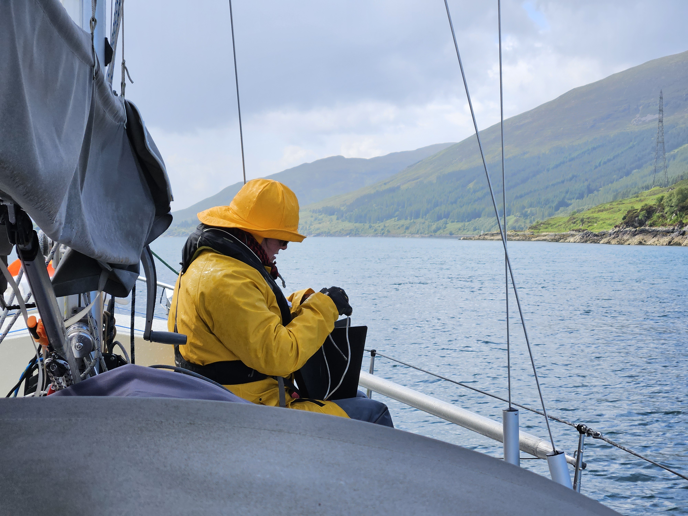

The guest moorings at Plockton worked all right. We got to visit the village pub, and the mooring held through the gusty, rolly day. But today the forecast looked a little bit better, and so we wanted to try solving our next puzzle: the famous tidal gate at Kyle Rhea.

In this sound you can get tidal races up to 8kt, so there was absolutely no chance of making it through at the wrong time. And as it's been blowing from southwest, there was a significant chance of overfalls at the other end.

To sort it out, we chose to go through on the last hour of the favourable tide. This meant we passed the narrows with a relatively gentle 3kt current, and with no overfalls as the tide was already slackening.

 

Sailing-wise today contained everything, from tacking to dead downwind, rain and sunshine, and from light breezes to 30kt gusts when a thunderstorm overtook us. So lots of reefing and shaking the reef. The interior of the boat looks quite tumbled, but otherwise it was fun, active sailing.

 

Now we're anchored in the bay north of Isle Ornsay, just off the Isle of Skye. This should be a good place for tonight, and a good spot for choosing the window for passing Cape Ardnamurchan.

* Distance today: 23.5NM
* Total distance: 1522.2NM
* Lunch: shaksuka
* Engine hours: 1.1
