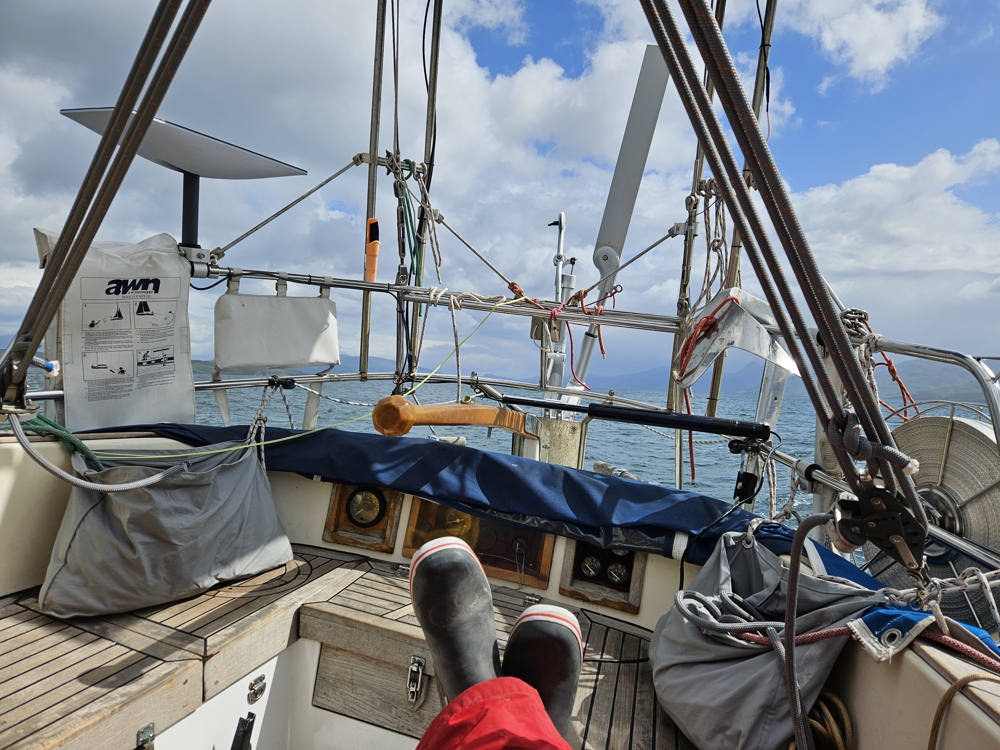
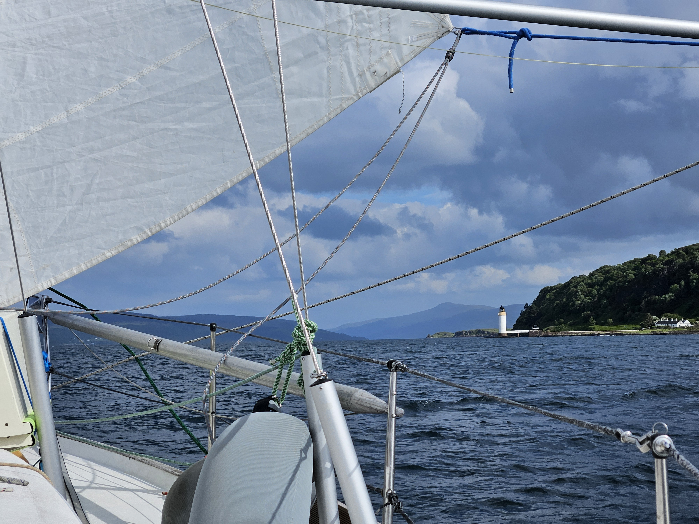

The Ornsay anchorage was very pretty, and the pub was fun. But now it was time to seek a bigger town and provision again. Freshies and snacks acquired from Kirkwall are officially out. And so we hoisted anchor in the morning and headed south.

In beginning it looked like a repeat of yesterday - gusty squalls and sunny calms. But when we got out of Skye's shadow, the sky cleared and the wind stayed more constant. And so from an upwind sail we moved to a beam reach without changing course.

 

This sail was a good example of how landmasses twist winds and waves, with the gentle Atlantic swell becoming a confused mess whenever we were downwind of an island.

 

After rounding Cape Ardnamurchan, we arrived to the pretty, colorful town of Tobermory. Here we'll do a round of provisioning and other maintenance tasks before heading back to the promising anchorages around Mull.

* Distance today: 42.2NM
* Total distance: 1564.4NM
* Dinner: venison burger
* Engine hours: 1
