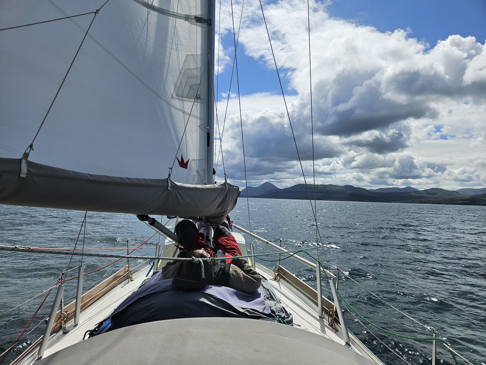

We woke up to a hustling harbour. It seemed everyone, including us had decided that today would be the day to sail to the next anchorage or marina. We exchanged last quick tips with various neighbours and headed for the fuel dock that had a steady atream on boats coming in and out. We filled the tank up, first time since Sweden and proceeded to hoist the main sail while still inside the protected bay.

 

Our course of the day was downwind aided by a 1.5 knot current. The sun shining and wind blasting on a nice 15 to 20 knots we made our way down to the narrow entrance of Loch Aline. Here the sea bed rises from 100 to 5 meters very steeply and the now 2.5 knot counter current gave us ample time to enjoy the scenery. This entrance I wouldn't want to sail in in the darkness like the heroes of sv Rustica in Celtic Ring.

Tomorrow it's going the blow a gale again, so we'll enjoy the scenery for a bit here.

 * Distance today: 13.7 NM
 * Total distance: 1578.1 NM
 * Lunch today: Curried cauliflower pie
 * Engine hours: 0.7
