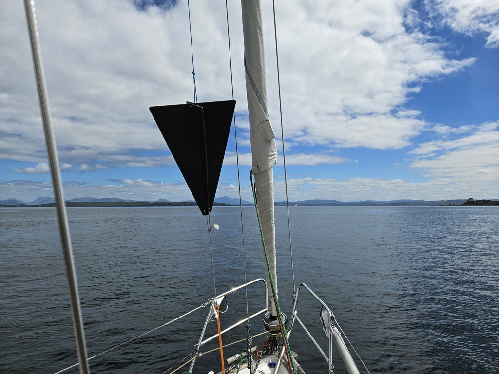

Loch Aline was a nice, sheltered anchorage. We generally only saw half of the forecasted wind speeds. And as the north quarter of the Loch dries out, we were able to forage ourselves a proper mussel dinner.

As we'll be picking up crew for the weekend, we hoisted the anchor and headed south for Oban. A sunny day, but with light winds that only barely kept us moving.

 

When we got turned 180° by a tidal eddy just before Duart Castle, it was time to accept the facts and get out the motorsailing cone. At Firth of Lorn the wind picked up again, and we were able to sail the rest of the way.

Now we're docked at the transit marina, and will continue adventures from here on Friday.

 

* Distance today: 14.6NM
* Total distance: 1592.7NM
* Lunch: Couscous salad
* Engine hours: 1.9
