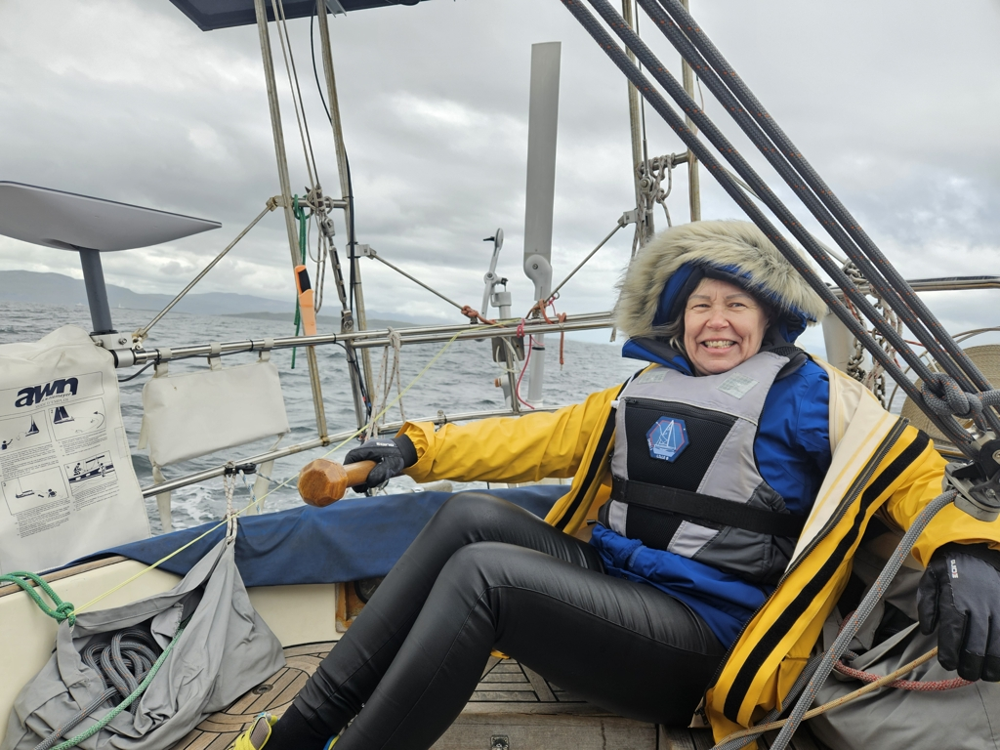
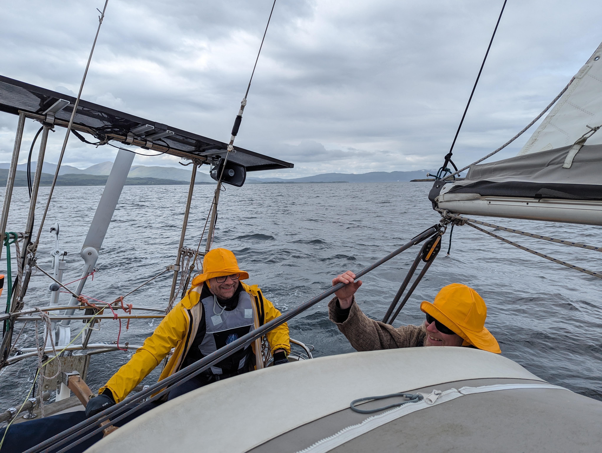

After the work day it was time to get our guests out for an evening sail. A rounding of Kerrera was planned and executed. After the harbour we sailed out of the North Sound with a nice beam reach.

 

After the sound we settled to an upwind course to gain the needed height. As per expected the wind kept weering we made our only tack at the entrance to Loch Spelve. After that is first upwind that we slowly eased to beam reach and later at Kerrera Sound to dead downwind with poled out wing on wing.

 

Then back into Oban transit marina. Somebody was playing bagpipes ashore as we came in. This is peak Scotland right here.

* Distance today: 15.2NM
* Total distance: 1607.9NM
* Lunch today: Chanterelle risotto
* Engine hours: 0.3
