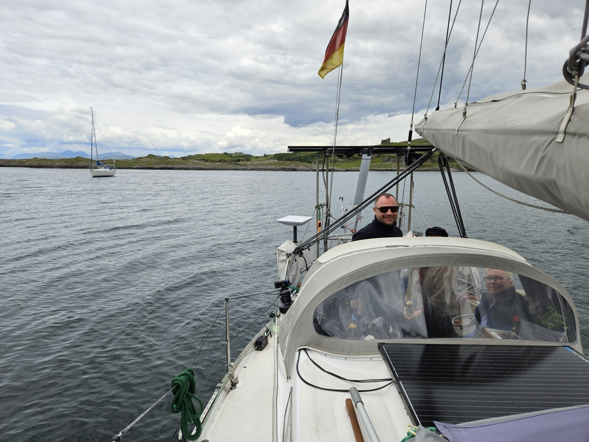

After a fun night in Oban, we decided to go anchoring with the crew. So, breakfast and under way!

Due to the light winds, we hoisted sail only after passing through the heavy traffic on the North Sound. Then on close reach towards the Isle of Mull.

Just like the last time around, at Duart Point the wind died. So we motored the rest of the way to Bernera Island. We saw some seals, and a pod of porpoises.

 

Now we're anchored at another piece of Peak Scotland: on the shore there is a castle ruin, and in the distance we can see a snow-capped mountain. Splendid!

* Distance today: 9.4NM
* Total distance: 1617.4NM
* Lunch: Jennifer Aniston salad
* Engine hours: 1.2
